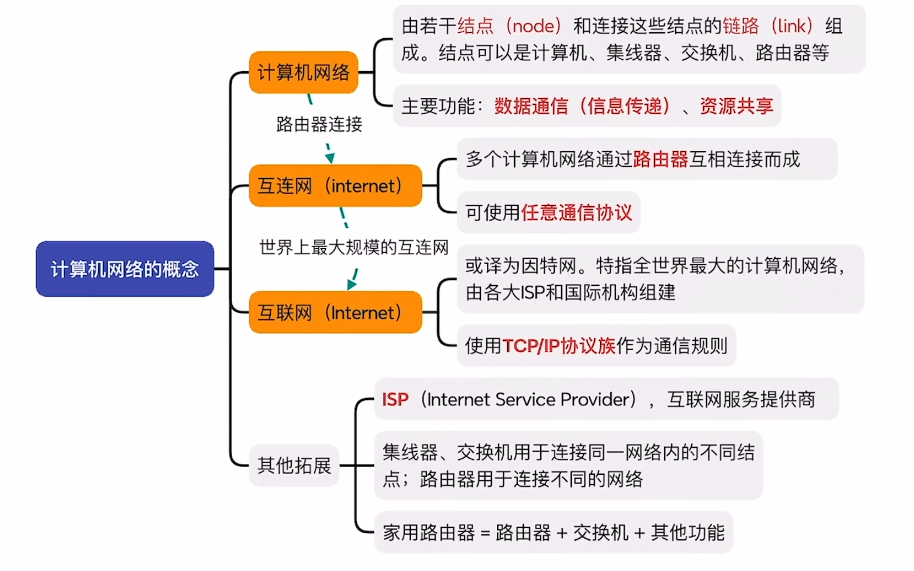
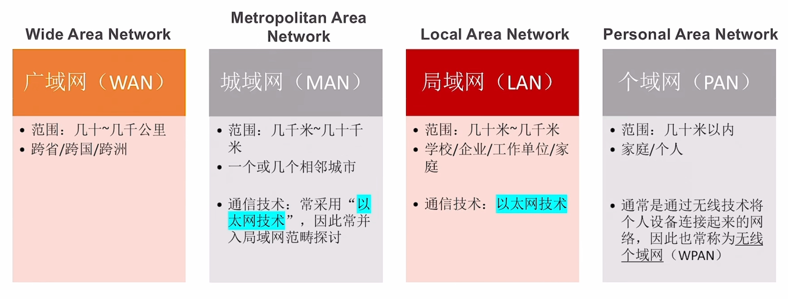
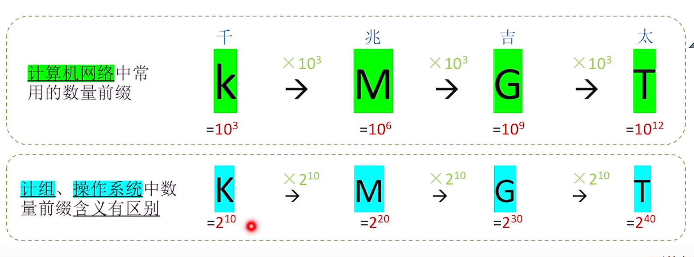

# 1. 计算机网络体系结构

## 1.1 计算机网络概述

计算机网络是一个将众多分散的、具有独立功能的计算机系统，通过通信设备与线路连接起来，由功能完善的软件实现资源共享和信息传递的系统。

**计算机网络、互连网、互联网的区别**

## 1.2 计算机网络的组成与功能

**组成：**

- 从组成部分看

  - 硬件
    - 主机，即端系统(end system)。如：电脑、手机、物联网设备
    - 通信设备。如：集线器、交换机、路由器
    - 通信链路。如：网线、光纤、同轴电缆
  - 软件
    - 方便用户使用，实现资源共享。如：聊天软件、网盘软件
  - 协议
    - 规定计算机网络中的通信规则。
    - 由硬件、软件共同实现。

- 从工作方式看

  - 边缘部分
    - 工作方式：直接为用户服务（通信、资源共享）
    - 主要由连接到互联网上的主机及其软件组成
  - 核心部分
    - 工作方式：为边缘部分提供服务（连通性、交换服务）
    - 由大量网络和连接这些网络的路由器组成

- 从逻辑功能看

  - 资源子网

    - 计算机网络中运行应用程序，向用户提供可共享的硬件、软件和信息资源的部分
    - 主要由连接到互联网的主机组成

  - 通信子网

    - 计算机网络负责计算机间信息传输的部分。即把计算机和其他用户装置互连在一起的所有通信设备和介质的总称。
    - 主要由 通信链路+通信设备+协议 构成

    > 注：主机内部实现信息传输的网络适配器、底层协议属于通信子网的范畴

**功能：**

- 数据通信：实现计算机之间数据传输；是最基础，最重要的功能。
- 资源共享：硬件、软件、数据资源共享
- 分布式处理：将某个复杂任务分配给网络中多台计算机处理
- 提高可靠性：网络中各台计算机互为替代机
- 负载均衡：网络中各台计算机共同分担繁重的工作
- 其他：满足社会需求、生活需求

## 1.3 电路交换、报文交换、分组交换

### 电路交换

1. 电路交换（Circuit Switching）：通过物理线路的连接，动态地分配传输线路资源
2. 交换过程：
   1. 建立连接（尝试占用通信资源）
   2. 通信（一直占用通信资源）
   3. 释放连接（归还通信资源）
3. 优点：
   - 通信前从主叫端到被叫端建立一条专用的物理通路，在通信的全部时间内，两个用户始终占用端到端的线路资源。
   - 数据直送，传输速率高。
4. 缺点：
   - 建立/释放连接，需要额外的时间开销。
   - 线路被通信双方独占，利用率低。
   - 线路分配的灵活性差。
   - 交换节点不支持“差错控制”（无法发现传输过程中发生的数据错误）

### 报文交换

1. 报文交换：通过存储-转发机制，将整条消息从源节点传输到目的节点，中间节点会临时存储整条消息并逐步转发。

   > 存储转发的思想：把传送的数据单元先存储进中间节点，再根据目的地址转发至下一节点。

2. 交换过程：

   1. 消息创建与发送
   2. 存储与转发
   3. 消息接收与处理

3. 优点：

   - 通信前无需建立连接
   - 数据以“报文“为单位被交换节点间“存储转发”，通信线路可以灵活分配
   - 在通信时间内，两个用户无需独占一整条物理线路。相比电路交换，线路利用率高
   - 交换节点支持”差错控制“（通过校验技术）

4. 缺点：

   - 报文不定长，不方便存储转发管理
   - 长报文的存储转发时间开销大、缓存开销大
   - 长报文容易出错，重传代价高

### 分组交换

1. 分组交换：将数据分割成独立的分组，通过网络中的不同路径传输到目的地，在目的地重新组装成完整的消息。

2. 交换过程：

   1. 数据分割
   2. 分组传输
   3. 路径选择
   4. 到达目的地
   5. 数据重组

3. 优点：

   - 通信前无需建立连接
   - 数据以“分组“为单位被交换节点间“存储转发”，通信线路可以灵活分配
   - 在通信时间内，两个用户无需独占一整条物理线路。相比电路交换，线路利用率高
   - 交换节点支持”差错控制“（通过校验技术）

   相比于报文交换，分组交换改进了如下问题：

   - 分组定长，方便存储转发管理
   - 分组的存储转发时间开销小、缓存开销小
   - 分组不易出错，重传代价低

4. 缺点：

   - 相比于报文交换，控制信息占比增加。
   - 相比于报文交换，依然存在存储转发时延。
   - 报文被拆分成多个分组，传输过程中可能出现失序、丢失等问题，增加处理的复杂度。

### 三种交换方式的性能对比

|                        |           电路交换            | 报文交换 |        分组交换        |
| :--------------------: | :---------------------------: | :------: | :--------------------: |
|    完成传输所需时间    | 最少（排除建立/释放连接耗时） |   最多   |          较少          |
|      存储转发时延      |              无               |   较高   |          较低          |
| 通信前是否需要建立连接 |              是               |    否    |           否           |
|        缓存开销        |              无               |    高    |           低           |
|   是否支持差错控制？   |            不支持             |   支持   |          支持          |
|   报文是否有序到达？   |              是               |    是    |           否           |
| 是否需要额外的控制信息 |              否               |    是    | 是（控制信息占比最大） |
|     线路分配灵活性     |            不灵活             |   灵活   |        非常灵活        |
|       线路利用率       |              低               |    高    |         非常高         |

## 1.4 计算机网络的分类

### 按分布范围分类

- 广域网（WAN）
- 城域网（MAN）
- 局域网（LAN）
- 个域网（PAN）

### 按传输技术分类

- 广播式网络：当一台计算机发送数据分组时，广播范围内所有计算机都会收到该分组，并通过检查分组的目的地址决定是否接受该分组。

  > Eg：所有无线网络都是“广播式”。

- 点对点网络：数据只会从发送方“点对点”发到接收方，精准送达。

  > Eg：路由器转发的数据分组。

### 按拓扑结构分类

- 总线型：数据“广播式”传输；存在“总线争用”问题。
- 环形：数据“广播式”传输；通过“令牌”解决总线争用问题，令牌顺环依次传递，拿到令牌者可使用总线。
- 星形：由中央设备实现数据“电镀点”传输；不存在“总线争用”问题。
- 网形：数据通过各中间节点逐一存储转发；属于“点到点”传输。

### 按使用者分类

- 公用网：向公众开放的网络。
- 专用网：仅供某个组织内部使用的网络。

### 按传输介质分类

- 有线网络：如：网线、光纤
- 无线网络：如：5G、WIFI、卫星

## 1.5 计算机网络的性能指标

- 速率：指连接到网络上的节点在信道上传输数据的速率。也称数据率或比特率、数据传输率。

  速率单位：bit/s，或b/s，或bps

  > 信道：表示向某一方向传输信息的通道（信道 != 通信线路）
  >
  > 一条通信线路在逻辑上往往对应一条发送信道和一条接受信道。

  注意⚠️：有时也会用B/s（1B = 8b，B=Byte字节，b=bit比特）

  

- 带宽：某信道所能传送的最高数据率。

  单位：bps（或记为b/s、bit/s；可加前缀k、M、G、T）。

  > 带宽：表示某信道允许通过的信号频带范围。
  >
  > 单位：Hz（读作“赫/赫兹”；可加前缀k、M、G、T）。

- 吞吐量：指单位时间内通过某个网络（或信道、接口）的实际数据量。

  单位：bps（或记为b/s、bit/s；可加前缀k、M、G、T）。

- 时延：指数据（报文/分组/比特率）从网络（或链路）的一段传送到另一端所需的时间。有时也称为延迟或迟延。

  总时延 = 发送（传输）时延 + 传播时延 + 处理时延 + 排队时延

  - 发送/传输时延 = 节点将数据推向信道所花的时间。（ 发送/传输时延 = 数据⻓度 / 信道带宽）
  - 传播时延 = 电磁波在信道中传播一定的距离所花的时间。（传播时延 = 链路⻓度 / 电磁波在信道上传播的速率）
  - 处理时延 = 被路由器处理所花的时间（如：分析首部、查找存储转发表）。
  - 排队时延 = 数据排队进入、排队发出路由器所花的时间。

- 时延带宽积：一条链路中，已从发送端发出但尚未到达接收端的最大比特数。表示的是容量。

  时延带宽积 = 传播时延 x 带宽

- 往返时延：从发送方发送完数据开始，到发送方收到接收方的确认（接收方收到数据后立即发送确认）共经历的时延。

  RTT = 往返传播时延 + 接收方收到数据后的处理时延 + 接收方的发送时延（注意：不包括发送方的发送时延） 

- 信道利用率：有数据通过的时间 /（有+无）数据通过的时间。利用率低会浪费带宽资源；利用率太高可能导致网络拥塞。

# 2. 物理层

# 3. 数据链路层

# 4. 网络层

# 5. 传输层

# 6. 应用层

# 面试题

## 应用层

### 请简述三次握手阶段

1. ① 首先客户端向服务器发送一个 SYN 包，并等待服务器确认
2. ② 服务器接收到客户端发来的 SYN 包后，对该包进行确认后结束 LISTEN 阶段，并返回一段 TCP 报文
3. ③ 客户端接收到发送的 SYN + ACK 包后，明确了从客户端到服务器的数据传输是正常的，从而结束 SYN-SENT 阶段。并返回最后一段报文。

### 如果第二次握手的时候每次握手信息对方没有收到会如何？

若第二次握手客户端未接收到服务器回应的 ACK 报文时，客户端会采取第一次握手失败时的动作，这里不再重复，而服务器端此时将阻塞在 accept() 系统调用处等待 client 再次发送 ACK 报文。

### 三次握手的目的是什么？两次握手可以吗？

- 三次握手的主要目的是确认自己和对方的发送和接收都是正常的，从而保证了双方能够进行可靠通信。
- 若采用两次握手，当第二次握手后就建立连接的话，此时客户端知道服务器能够正常接收到自己发送的数据，而服务器并不知道客户端是否能够收到自己发送的数据。若只有两次握手，会造成服务器开销的浪费。

