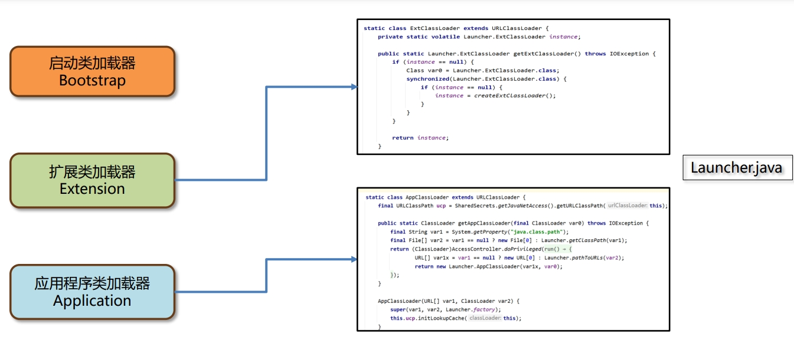

# Java虚拟机（Jvm）

> JVM 全称是 Java Virtual Machine，中文译名 Java 虚拟机

## 1、入门介绍

JVM 本质上是一个运行在计算机上的程序，他的职责是运行Java字节码文件


### 1.1、Jvm的功能

1. 解释和运行
   - 对字节码文件中的指令， 实时的解释成机器码， 让计算机执行
2. 内存管理
   - 自动为对象、方法等分配内存 
   - 自动的垃圾回收机制， 回收不再使用的对象
3. 即时编译
   - 对热点代码进行优化， 提升执行效率

> **即时编译**
>
> Java语言如果不做任何优化，性能不如C、C++等语言。
>
> Java需要实时解释，主要是为了支持跨平台特性。
>
> 由于JVM需要实时解释虚拟机指令，不做任何优化性能不如直接运行机器码的C、C++等语言。
>
> JVM提供了即时编译（Just-In-Time 简称JIT) 进行性能的优化，最终能达到接近C、C++语言的运行性能 甚至在特定场景下实现超越。


### 1.2、常见的Jvm


## 2、字节码文件的组成

> 1. 基本信息：魔数、字节码文件对应的Java版本号，访问标识(public final等等) 父类和接口
> 2. 常量池：保存字符串常量、类或接口名、字段名，主要在字节码指令中使用
> 3. 字段：当前类或接口声明的字段信息
> 4. 方法：当前类或接口声明的方法信息、字节码指令
> 5. 属性：类的属性，比如源码的文件名、内部类的列表等

### 2.1、字节码文件的组成部分

#### 2.1.1、Magic魔数

文件是无法通过文件扩展名来确定文件类型的，文件扩展名可以随意修改，不影响文件的内容。

软件使用文件的头几个字节（文件头）去校验文件的类型，如果软件不支持该种类型就会出错。

Java字节码文件中，将文件头称为magic魔数。


#### 2.1.2、主副版本号

主副版本号指的是编译字节码文件的JDK版本号。

主版本号用来标识大版本号，JDK1.0-1.1使用了 45.0-45.3，JDK1.2是46之后每升级一个大版本就加1。

副版本号是当主版本号相同时作为区分不同版本的标识，一般只需要关心主版本号。

版本号的作用主要是判断当前字节码的版本和运行时的JDK是否兼容。

> 🔔1.2之后大版本号计算方法就是: 主版本号–44，比如主版本号52就是JDK8


#### 2.1.3、常量池

 字节码文件中常量池的作用：避免相同的内容重复定义，节省空间。

常量池中的数据都有一个编号，编号从1开始。在字段或者字节码指令中通过编号可以快速的找到对应的数据。

字节码指令中通过编号引用到常量池的过程称之为符号引用。


#### 2.1.4、方法

字节码中的方法区域是存放字节码指令的核心位置，字节码指令的内容存放在方法的Code属性中。

操作数栈是临时存放数据的地方，局部变量表是存放方法中的局部变量的位置。


### 2.2、查看字节码常用工具

#### 2.2.1、 javap -v命令

javap是JDK自带的反编译工具，可以通过控制台查看字节码文件的内容。适合在服务器上查看字节码文件内 容。

直接输入javap查看所有参数。

 输入javap -v 字节码文件名称 查看具体的字节码信息。（如果jar包需要先使用 jar –xvf 命令解压）


#### 2.2.2、jclasslib插件

jclasslib也有Idea插件版本，建议开发时使用Idea插件版本，可以在代码编译之后实时看到字节码 文件内容。


#### 2.2.3、阿里arthas

> 官网：https://arthas.aliyun.com/doc/

Arthas 是一款线上监控诊断产品，通过全局视角实时查看应用 load、内存、gc、线程的状态信息，并能在不修 改应用代码的情况下，对业务问题进行诊断，大大提升线上问题排查效率。

dump 类的全限定名：dump已加载类的字节码文件到特定目录。 

jad 类的全限定名： 反编译已加载类的源码。


### 2.3、总结

#### 1、如何查看字节码文件？ 

1. 本地文件可以使用jclasslib工具查看，开发环境使用jclasslib插件。
2. 服务器上文件使用javap命令直接查看，也可以通过arthas的dump命令导出字节码文件再查看本地文件。还可以使用jad命令反编译出源代码。

#### 2、字节码文件的核心组成有哪些？


#### 3、Jvm组成?


## 3、类的生命周期

### 3.1、生命周期概述


### 3.2、加载阶段

1. 类加载器根据类的全限定名通过不同的渠道以二进制流的方式获取字节码信息。
2. 类加载器在加载完类之后，Java虚拟机会将字节码中的信息保存到方法区中以及内存的方法区中，然后生成一个InstanceKlass对象，保存类的所有信息，包含实现特定功能比如多态的信息。
3. Java虚拟机在堆中生成一份与方法区中数据类似的java.lang.Class对象。 作用是在Java代码中去获取类的信息以及存储静态字段的数据（JDK8及之后）。

对于开发者来说，只需要访问堆中的Class对象而不需要访问方法区中所有信息。因此Java虚拟机能很好地控制开发者访问数据的范围。


### 3.3、连接阶段

#### 3.3.1、验证

验证的主要目的是检测Java字节码文件是否遵守《Java虚拟机规 范》中的约束。

主要包含如下四部分：具体详见《Java虚拟机规范》

1. 文件格式验证，比如文件是否以0xCAFEBABE开头，主次版本号是否满足当前Java虚拟机版本要求。
2. 元信息验证，例如类必须有父类（super不能为空）。
3. 验证程序执行指令的语义，比如方法内的指令执行到一半强行跳转到其他方法中去。
4. 符号引用验证，例如是否访问了其他类中private的方法等。


#### 3.3.2、准备

1、准备阶段为静态变量（static）分配内存并设置初始值。

准备阶段只会给静态变量赋初始值，而且每种基本数据类型和引用数据类型都有其初始值。


2、final修饰的基本数据类型的静态变量，准备阶段直接会将代码中的值进行赋值。


#### 3.3.3、解析

解析阶段主要是将常量池中的符号引用替换为直接引用。 

- 符号引用就是在字节码文件中使用编号来访问常量池中的内容。
- 直接引用不在使用编号，而是使用内存中地址进行访问具体的数据。


### 3.4、初始化阶段

1、初始化阶段会执行静态代码块中的代码，并为静态变量赋值。

2、初始化阶段会执行字节码文件中clinit部分的字节码指令。


以下方式会进行类的初始化： 

1. 访问一个类的静态变量或者静态方法，注意变量是final修饰的并且等号右边是常量不会触发初始化。 
2. 调用Class.forName(String className)。 
3. new一个该类的对象时。 
4. 执行Main方法的当前类。

> 🔔添加-XX:+TraceClassLoading 参数可以打印出加载并初始化的类


clinit指令在特定情况下不会出现。如下情况不会进行初始化指令执行：

1. 无静态代码块且无静态变量赋值语句。 
2. 有静态变量的声明，但是没有赋值语句。 
3. 静态变量的定义使用final关键字，这类变量会在准备阶段直接进行初始化。


注意：

- 直接访问父类的静态变量，不会触发子类的初始化。
- 子类的初始化clinit调用之前，会先调用父类的clinit初始化方法。


### 3.5、总结

1. 数组的创建不会导致数组中元素的类进行初始化。

2. final修饰的变量如果赋值的内容需要执行指令才能得出结果，会执行clinit方法进行初始化

3. 类的生命周期

   > 1. 加载：根据类的全限定名把字节码文件的 内容加载并转换成合适的数据放入 内存中，存放在方法区和堆上。
   > 2. 连接-验证：魔数、版本号等验证，一般不需要 程序员关注。
   > 3. 连接-准备：为静态变量分配内存并设置初始值。
   > 4. 连接-解析：将常量池中的符号引用（编号）替 换为直接引用（内存地址）
   > 5. 初始化：执行静态代码块和静态变量的赋值。

4. 静态变量的定义使用final关键字，这类变量会在准备阶段直接进行初始化 （除非要执行方法）。

5. 直接访问父类的静态变量，不会触发子类的初始化。子类的初始化cinit调用之前， 会先调用父类的cinit初始化方法。

> 添加-XX:+TraceClassLoading 参数可以打印出加载并初始化的类


## 4、类加载器

类加载器（ClassLoader）是Java虚拟机提供给应用程序去实现获取类和接口字节码数据的技术，只参与加载过程中的字节码获取并加载到内存。

### 4.1、类加载器的分类

类加载器分为两类：一类是Java代码中实现的，一类是Java虚拟机底层源码实现的。

1. 虚拟机底层实现：
   - 虚拟机底层实现：源代码位于Java虚拟机的源码中，实现语言与 虚拟机底层语言一致，比如Hotspot使用C++。
   - 加载程序运行时的基础类：保证Java程序运行中基础类被正确地加载， 比如 java.lang.String ，确保其可靠性。
2. Java：
   - JDK中默认提供或者自定义：JDK中默认提供多种处理不同渠道的类加载器， 程序员也可以根据需求定制。
   - 继承自抽象类ClassLoader：所有Java中实现的类加载器都需要继承 ClassLoader 该抽象类。


类加载器的设计JDK8和8之后的版本差别较大，JDK8及之前的版本中默认的类加载器有如下几种：

1. 虚拟机底层实现 C++ ：
   - 启动类加载器 Bootstrap ：加载Java中最核心的类。
2. Java ：
   - 扩展类加载器 Extension ：允许扩展Java中比较通用的类。
   - 应用程序类加载器 Application ：加载应用使用的类。

> Arthas中类加载器相关的功能
>
> 类加载器的详细信息可以通过classloader命令查看：
>
> - classloader - 查看 classloader 的继承树、urls、类加载信息，使用 classloader 去 getResource。
>
> 


类加载器的作用是什么？

类加载器（ClassLoader）负责在类加载过程中把字节码获取并加载到内存的部分。通过加载字节码数据放入内存转换成byte[]，然后调用虚拟机底层方法将byte[]转换成方法区和堆中的数据。


#### 4.1.1、启动类加载器

启动类加载器（Bootstrap ClassLoader）是由Hotspot虚拟 机提供的、使用C++编写的类加载器。默认加载Java安装目录/jre/lib下的类文件，比如rt.jar、tools.jar、resources.jar等。

通过启动类加载器去加载用户jar包：

- 放入jre/lib下进行扩展：不推荐，尽可能不要去更改JDK安装目录中的内容，会出现即时放进去由于文件名不匹配的问题也不会正常地被加载。
- 使用参数进行扩展：推荐，使用-Xbootclasspath/a:jar包目录/jar包名进行扩展。


#### 4.1.2、Java中的默认类加载器

- 扩展类加载器和应用程序类加载器都是JDK中提供的、使用Java编写的类加载器。
- 它们的源码都位于sun.misc.Launcher中，是一个静态内部类。继承自URLClassLoader。具备通过目录 或者指定jar包将字节码文件加载到内存中。


> Arthas中类加载器相关的功能:
>
> - classloader –l ：查看类加载器列表。
> - classloader –c hash值 ： 查看类加载器的加载路径。


### 4.2、双亲委派机制

> 在Java中如何使用代码的方式去主动加载一个类呢？
>
> 1. 方式1：使用Class.forName方法，使用当前类的类加载器去加载指定的类
> 2. 方式2：获取到类加载器，通过类加载器的loadClass方法指定某个类加载器加载。

每个Java实现的类加载器中保存了一个成员变量叫“父”（Parent）类加载器，可以理解为它的上级， 并不是继承关系。

- 应用程序类加载器的parent父类加载器是扩展类加载器，而扩展类加载器的parent是空。
- 启动类加载器使用C++编写，没有上级类加载器。


> Arthas中类加载器相关的功能：类加载器的继承关系可以通过 classloader –t 查看

#### 4.2.1、类加载步骤

1. 在类加载的过程中，每个类加载器都会先检查是否已经加载了该类，如果已经加载则直接返回，否则会将加载请求委派给父类加载器。
2. 如果类加载的parent为null，则会提交给启动类加载器处理。
3. 如果所有的父类加载器都无法加载该类，则由当前类加载器自己尝试加载。
4. 再次加载相同的类，仍然会向上进行委派，如果某个类加载器加载过就会直接返回。


> ## 双亲委派机制指的是：自底向上查找是否加载过，再由顶向下进行加载。


#### 4.2.2、双亲委派机制-解决三个问题

1. 重复的类：如果一个类重复出现在三个类加载 器的加载位置，应该由谁来加载？
   - 启动类加载器加载，根据双亲委派 机制，它的优先级是最高的。
2. String类能覆盖吗：在自己的项目中去创建一个 java.lang.String 类会被加载吗？
   - 不能，会交由启动类加载器加载在 rt.jar包中的String类。
3. 类加载器的关系：这几个类加载器彼此之间存在关系吗？
   - 应用类加载器的父类加载器是扩展类加载器，扩展类加载器没有父类加载器，但是会委派给启动类加载 器加载。


#### 4.2.3、双亲委派机制有什么用？

1、保证类加载的安全性通过双亲委派机制，让顶层的类加载器去加载核心类，避免恶意代码替换JDK中的核心类库，比如 java.lang.String，确保核心类库的完整性和安全性。

2、避免重复加载双亲委派机制可以避免同一个类被多次加载，上层的类加载器如果加载过类，就会直接返回该类，避免重复加载。


### 4.3、打破双亲委派机制

> 打破双亲委派机制的三种方式：
>
> 1. 自定义类加载器
>    - 通过重写 loadClass 方法可以将双亲委派机制的代码去除，Tomcat通过该方式实现应用之间类隔离。
> 2. 线程上下文类加载器
>    - 利用上下文类加载器加载类，比如 JDBC 和 JNDI 等。
> 3. Osgi框架的类加载器
>    - 历史上Osgi框架实现一套新的类加载器机制，允许同级之间委托进行类的加载。

#### 4.3.1、自定义类加载器


一个Tomcat程序中是可以运行多个Web应用的，如果两个应用中出现相同限定名的类，比如Servlet类， Tomcat要保证这两个类都能加载并且它们应该是不同的类。如果不打破双亲委派机制，当应用类加载器加载Web应用1中的MyServlet之后，Web应用2中相同限定名的 MyServlet类就无法被加载。

Tomcat使用自定义类加载器来实现应用之间类的隔离，每个应用都有独立的类加载器加载对应的类。

双亲委派机制的核心代码


> 🔔loadClass方法的核心逻辑：双亲委派机制

两个自定义类加载器加载相同限定名的类，不会冲突吗？

1. 不会冲突。在同一个Java虚拟机中，只有相同类加载器+相同的类限定名才会被认为是同一个类。
2. 在Arthas中使用 sc –d 类名的方式查看具体的情况。


#### 4.3.2、线程上下文类加载器

> #### JDBC案例

JDBC中使用 DriverManager 来管理项目中引入的不同数据库的驱动。比如mysql驱动、oracle驱动。

- DriverManager类位于rt.jar包中，由启动类加载器加载。
- 依赖中的mysql驱动对应的类，由应用程序类加载器来加载。

DriverManager属于rt.jar是启动类加载器加载的，而用户jar包中的驱动需要由应用类加载器加载，这就违反了双亲委派机制。


DriverManage使用SPI机制，最终加载jar包中对应的驱动类。SPI中使用线程上下文中保存的类加载器进行类的加载，该类加载器一般是应用程序类加载器。

> 总结：
>
> 1. 启动类加载器加载DriverManager。
> 2. 在初始化DriverManager时，通过SPI机制加载jar包中的myql驱动。
> 3. SPI中利用了线程上下文类加载器（应用程序类加载器）去加载类并创建对象。
>
> 这种由启动类加载器加载的类，委派应用程序类加载器去加载类的方式，打破了双亲委派机制。
>
> 
>
> 


JDBC案例中真的打破了双亲委派机制吗？

- 打破了双亲委派机制：这种由启动类加载器加载的类，委派 应用程序类加载器去加载类的方式， 打破了双亲委派机制。
- 没有打破双亲委派机制：JDBC只是在DriverManager加载完之后，通过初始化阶段触发驱动类的加载，类的加载依然遵循双亲委派 机制。


#### 4.3.3、OSGI模块化

历史上OSGi模块化框架存在同级之间的类加载器的委托加载。OSGI还使用类加载器实现热部署的功能。

热部署指的是在服务不停止的情况下，动态地更新字节码文件到内存中。


> 使用阿里arthas不停机解决线上问题：
>
> 1. 背景：小李的团队将代码上线之后，发现存在一个小bug，但是用户急着使用，如果重新打包再发布需要一个多小时的时间，所以希望能使用arthas尽快的将这个问题修复。
> 2. 思路：
>    1. 在出问题的服务器上部署一个 arthas，并启动。 
>    2. jad --source-only 类全限定名 > 目录/文件名.java
>       - jad 命令反编译，然后可以用其它编译器，比如 vim 来修改源码
>    3. mc –c 类加载器的hashcode 目录/文件名.java -d 输出目录
>       - mc 命令用来编译修改过的代码
>    4. retransform class文件所在目录/xxx.class
>       - 用 retransform 命令加载新的字节码
>
> 注意事项：
>
> 1. 程序重启之后，字节码文件会恢复，除非将class文件放入jar包中进行更新。
> 2. 使用retransform不能添加方法或者字段，也不能更新正在执行中的方法。


### 4.4、Jdk8前后的类加载器变化

#### 4.4.1、JDK8及之前的类加载器

JDK8及之前的版本中，扩展类加载器和应用程序类加载器的源码位于rt.jar包中的sun.misc.Launcher.java。




#### 4.4.1、JDK8之后的类加载器

1. 启动类加载器使用Java编写，位于jdk.internal.loader.ClassLoaders类中。 Java中的BootClassLoader继承自BuiltinClassLoader实现从模块中找到要加载的字节码资源文件。 启动类加载器依然无法通过java代码获取到，返回的仍然是null，保持了统一。
2. 扩展类加载器被替换成平台类加载器（Platform Class Loader）。平台类加载器遵循模块化方式加载字节码文件，所以继承关系从URLClassLoader变成 BuiltinClassLoader，BuiltinClassLoader实现了从模块中加载字节码文件。平台类加载器的存在更多的是为了与老版本的设计方案兼容，自身没有特殊的逻辑。


## 5、内存区域

Java虚拟机在运行Java程序过程中管理的内存区域，称之为运行时数据区。


### 5.1、程序计数器

1、程序计数器（Program Counter Register）也叫PC寄存器，每个线程会通过程序计数器记录当前要执行的的字节码指令的地址。

2、在加载阶段，虚拟机把字节码文件中的指令读取到内存后，会将原文件中的偏移量转换成内存地址。每条字节码指令都会拥有内存地址。

3、在代码执行过程中，程序计数器会记录下一行字节码指令的地址。执行完当前指令后，虚拟机的执行引擎根据程序计数器执行下一行指令。

4、在多线程执行情况下，Java虚拟机需要通过程序计数器记录CPU切换前解释执行到哪一条指令并继续解释运行。


程序计数器在运行中会出现内存溢出吗？

- 内存溢出指的是程序在使用某一块内存区域时，存放数据需要占用的内存大小超过虚拟机能提供的内存上限。
- 因为每个线程只存储一个固定长度的内存地址，程序计数器是不会发生内存溢出的。
- 程序员无需对程序计数器做任何处理。


### 5.2、Java虚拟机栈

Java虚拟机栈（Java Virtual Machine Stack）采用栈的数据结构来管理方法调用中的基本数据，先进后出（First In Last Out），每个方法的调用使用一个栈帧（Stack Frame）来保存。

Java虚拟机栈随着线程的创建而创建，而回收则会在线程的销毁时进行。由于方法可能会在不同线程中执行，每个线程都会包含一个自己的虚拟机栈。


Java虚拟机栈 - 栈帧的组成

- 局部变量表：局部变量表的作用是在运行过程 中存放所有的局部变量。
- 操作数栈：操作数栈是栈帧中虚拟机在执 行指令过程中用来存放临时数 据的一块区域。
- 帧数据：帧数据主要包含动态链接、方法出口、异常表的引用。


#### 5.2.1、局部变量表

局部变量表的作用是在方法执行过程中存放所有的局部变量。编译成字节码文件时就可以确定局部变量表的内容。

栈帧中的局部变量表是一个数组，数组中每一个位置称之为槽(slot) ，long和double类型占用两个槽，其他类型占用一个槽。

- 实例方法中的序号为0的位置存放的是this，指的是当前调用方法的对象，运行时会在内存中存放实例对象的地址。
- 方法参数也会保存在局部变量表中，其顺序与方法中参数定义的顺序一致。 
- 局部变量表保存的内容有：实例方法的this对象，方法的参数，方法体中声明的局部变量。

⚠️为了节省空间，局部变量表中的槽是可以复用的，一旦某个局部变量不再生效，当前槽就可以再次被使用。


#### 5.2.2、操作数栈

操作数栈是栈帧中虚拟机在执行指令过程中用来存放中间数据的一块区域。他是一种栈式的数据结构，如 果一条指令将一个值压入操作数栈，则后面的指令可以弹出并使用该值。

在编译期就可以确定操作数栈的最大深度，从而在执行时正确的分配内存大小。


#### 5.2.3、帧数据

当前类的字节码指令引用其他类的属性或者方法时，需要将符号引用（编号）转换成对应的运行时常量池中的内存地址。动态链接就保存编号到运行时常量池的内存地址的映射关系。

方法出口指的是方法在正确或者异常结束时，当前栈帧会被弹出，同时程序计数器应该指向上一个栈帧中的 下一条指令的地址。所以在当前栈帧中，需要存储此方法出口的地址。

异常表存放的是代码中异常的处理信息，包含了异常捕获的生效范围以及异常发生后跳转到的字节码指令位置。


#### 5.2.4、栈内存溢出

Java虚拟机栈如果栈帧过多，当占用内存超过栈内存可以分配的最大大小就会出现内存溢出。

Java虚拟机栈内存溢出时会出现StackOverflowError的错误。


#### 5.2.5、默认大小

如果不指定栈的大小，JVM将创建一个具有默认大小的栈。大小取决于操作系统和计算机的体系结构。


**设置大小：**使用虚拟机参数 -Xss

- 语法：-Xss栈大小
- 单位：字节（默认，必须是 1024 的倍数）、k或者K(KB)、m或者M(MB)、g或者G(GB)

**注意事项：**

1. 与-Xss类似，也可以使用 -XX:ThreadStackSize 调整标志来配置堆栈大小。 格式为：-XX:ThreadStackSize=1024

2. HotSpot JVM对栈大小的最大值和最小值有要求

   比如测试如下两个参数: 

   - -Xss1k
   - -Xss1025m

   Windows（64位）下的JDK8测试最小值为180k，最大值为1024m。

3. 局部变量过多、操作数栈深度过大也会影响栈内存的大小。

一般情况下，工作中即便使用了递归进行操作，栈的深度最多也只能到几百,不会出现栈的溢出。所以此参数 可以手动指定为-Xss256k节省内存。


#### 5.2.6、本地方法栈

Java虚拟机栈存储了Java方法调用时的栈帧，而本地方法栈存储的是native本地方法的栈帧。

在Hotspot虚拟机中，Java虚拟机栈和本地方法栈在实现上使用同一个栈空间。本地方法栈会在栈内存上生成一个栈帧，临时保存方法的参数，同时在出现异常时也方便把本地方法的栈信息打印出来。


### 5.3、堆

一般Java程序中堆内存是空间最大的一块内存区域。创建出来的对象都存在于堆上。栈上的局部变量表中，可以存放堆上对象的引用。静态变量也可以存放堆对象的引用，通过静态变量就可以实 现对象在线程之间共享。

> 模拟堆区的溢出
>
> - 需求： 通过new关键字不停创建对象，放入集合中，模拟堆内存的溢出，观察堆溢出之后的异 常信息。
> - 现象： 堆内存大小是有上限的，当对象一直向堆中放入对象达到上限之后，就会抛出OutOfMemory 错误。
>
> 

堆空间有三个值：used、total、max。

- used：当前已使用的堆内存。
- total：java虚拟机已经分配的可用堆内存。
- max：java虚拟机可以分配的最大堆内存。

> arthas中堆内存相关的功能：
>
> - 堆内存used total max三个值可以通过dashboard命令看到。
> - 手动指定刷新频率（不指定默认5秒一次）：dashboard –i 刷新频率(毫秒)。
>
> 

随着堆中的对象增多，当total可以使用的内存即将不足时，java虚拟机会继续分配内存给堆。

如果堆内存不足，java虚拟机就会不断的分配内存，total值会变大。total最多只能与max相等。


> 是不是当 `used = max = total` 的时候，堆内存就溢出了呢？
>
> - 不是，堆内存溢出的判断条件比较复杂，在下一章《垃圾回收器》中会详细介绍。
>
> 


如果不设置任何的虚拟机参数，max默认是系统内存的1/4，total默认是系统内存的1/64。

在实际应用中一般都需要设置 total 和 max 的值。

> Oracle官方文档：https://docs.oracle.com/javase/8/docs/technotes/tools/unix/java.html

设置大小：使用虚拟机参数 –Xmx（max最大值）和-Xms (初始的total)。

- 语法：-Xmx值 -Xms值
- 单位：字节（默认，必须是 1024 的倍数）、k或者K(KB)、m或者M(MB)、g或者G(GB) 
- 限制：Xmx必须大于 2 MB，Xms必须大于1MB

> 为什么arthas中显示的heap堆大小与设置的值不一样呢？
>
> - arthas中的heap堆内存使用JMX技术中内存获取方式，这种方式与垃圾回收器有关，计算的是可以分配对象的内存，而不是整个内存。
>
> 

Java服务端程序开发时，建议将-Xmx和-Xms设置为相同的值，这样在程序启动之后可使用的总内存就是最大内存，而无需向java虚拟机再次申请，减少了申请并分配内存时间上的开销，同时也不会出现内存过剩之后堆收缩的情况。

 -Xmx具体设置的值与实际的应用程序运行环境有关，在《实战篇》中会给出设置方案。


### 5.4、方法区

方法区（Method Area）是存放基础信息的位置，线程共享，主要包含三部分内容：

- 类的元信息：保存所有类的基本信息。
- 运行时常量池：保存字节码文件中的常量池内容。
- 字符串常量池：保存字符串常量

方法区是用来存储每个类的基本信息（元信息），一般称之为InstanceKlass对象。在类的加载阶段完成。


#### 5.4.1、元信息&运行时常量池

方法区除存储类的元信息之外，还存放运行时常量池。常量池中存放的是字节码中的常量池内容。

- 静态常量池：通过字节码文件中编号查表的方式找到常量，这种常量池称为静态常量池。
- 运行时常量池：当常量池加载到内存中之后，可以通过内存地址快速的定位到常量池中的内容，这种常量池称为运行时常量池。


方法区是《Java虚拟机规范》中设计的虚拟概念，每款Java虚拟机在实现上都各不相同。

Hotspot设计如下：

- JDK7及之前的版本将方法区存放在堆区域中的永久代空间，堆的大小由虚拟机参数来控制。
- JDK8及之后的版本将方法区存放在元空间中，元空间位于操作系统维护的直接内存中，默认情况下只要不超过操作系统承受的上限，可以一直分配。

> arthas中查看方法区：
>
> - 使用memory打印出内存情况，JDK7及之前的版本查看ps_perm_gen属性。
> - JDK8及之后的版本查看metaspace属性。


实验：模拟方法区的溢出

需求： 通过ByteBuddy框架，动态生成字节码数据，加载到内存中。通过死循环不停地加载到方法区，观察方法区是 否会出现内存溢出的情况。分别在JDK7和JDK8上运行上述代码。

> ByteBuddy框架的基本使用方法：ByteBuddy是一个基于Java的开源库，用于生成和操作Java字节码。
>
> 1. 引入依赖
>
>    ```xml
>    <dependency>
>    	<groupId>net.bytebuddy</groupId>
>    	<artifactId>byte-buddy</artifactId>
>    	<version>1.12.23</version>
>    </dependency>
>    ```
>
> 2. 创建ClassWriter对象
>
>    ```java
>    ClassWriter classWriter = new ClassWriter(0);
>    ```
>
> 3. 调用visit方法，创建字节码数据。
>
>    ```java
>    classWriter.visit(Opcodes.V1_7,Opcodes.ACC_PUBLIC,name,null ,"java/lang/Object",null);
>    byte[] bytes = classWriter.toByteArray();
>    ```
>
> 

实验发现，JDK7上运行大概十几万次，就出现了错误。在JDK8上运行百万次，程序都没有出现任何错误，但是内存会直线升高。这说明JDK7和JDK8在方法区的存放上，采用不同的设计。

- JDK7将方法区存放在堆区域中的永久代空间，堆的大小由虚拟机参数-XX:MaxPermSize=值来控制。

- JDK8将方法区存放在元空间中，元空间位于操作系统维护的直接内存中，默认情况下只要不超过操作系统承受 的上限，可以一直分配。可以使用-XX:MaxMetaspaceSize=值将元空间最大大小进行限制。

  


#### 5.4.2、字符串常量池

字符串常量池（StringTable）存储在代码中定义的常量字符串内容。


字符串常量池和运行时常量池有什么关系？

早期设计时，字符串常量池是属于运行时常量池的一部分，它们存储的位置也是一致的。后续做出调整， 将字符串常量池和运行时常量池做拆分。


静态变量存储在哪里呢？

- JDK6及之前的版本中，静态变量是存放在方法区中的，也就是永久代。
- JDK7及之后的版本中，静态变量是存放在堆中的Class对象中，脱离了永久代。


### 5.5、直接内存

直接内存（Direct Memory）并不在《Java虚拟机规范》中存在，所以并不属于Java运行时的内存区域。

在 JDK 1.4 中引入 NIO 机制并使用直接内存，主要为了解决以下两个问题: 

1. Java堆中的对象如果不再使用要回收，回收时会影响对象的创建和使用。 
2. IO操作比如读文件，需要先把文件读入直接内存（缓冲区）再把数据复制到Java堆中。

现在直接放入直接内存即可，同时Java堆上维护直接内存的引用，减少了数据复制的开销。写文件也是类似的思路。


> 要创建直接内存上的数据，可以使用ByteBuffer。
>
> - 语法： ByteBuffer directBuffer = ByteBuffer.allocateDirect(size);
>
> 注意事项：arthas的memory命令可以查看直接内存大小，属性名direct。


如果需要手动调整直接内存的大小，可以使用-XX:MaxDirectMemorySize=大小

- 单位k或K表示千字节，m或M表示兆字节，g或G表示千兆字节。默认不设置该参数情况下，JVM 自动选择 最 大分配的大小。

以下示例以不同的单位说明如何将直接内存大小设置为 1024 KB：

- -XX:MaxDirectMemorySize=1m
- -XX:MaxDirectMemorySize=1024k
- -XX:MaxDirectMemorySize=1048576


## 6、垃圾回收

1、C/C++的内存管理

- 在C/C++这类没有自动垃圾回收机制的语言中，一个对象如果不再使用，需要手动释放，否则就会出现内存泄漏。

  这种释放对象的过程称为垃圾回收，而需要程序员编写代码进行回收的方式为手动回收。

- 内存泄漏指的是不再使用的对象在系统中未被回收，内存泄漏的积累可能会导致内存溢出。

2、Java的内存管理

- Java中为简化对象的释放，引入自动的垃圾回收（Garbage Collection简称GC）机制。通过垃圾回收器来对不再使用的对象完成自动的回收，垃圾回收器主要负责对堆上的内存进行回收。
- 其他很多现代语言比如C#、Python、Go都拥有自己的垃圾回收器。

3、垃圾回收的对比

1. 自动垃圾回收：自动根据对象是否使用由虚拟机来回收对象
   - 优点：降低程序员实现难度、降低对象回收bug的可能性。
   - 缺点：程序员无法控制内存回收的及时性。
2. 手动垃圾回收：由程序员编程实现对象的删除
   - 优点：回收及时性高，由程序员把控回收的时机。
   - 缺点：编写不当容易出现悬空指针、重复释放、内存泄漏等问题。


**Java的内存管理和自动垃圾回收**

线程不共享的部分，都是伴随着线程的创建而创建，线程的销毁而销毁。而方法的栈帧在执行完方法之后就会自动弹出栈并释放掉对应的内存。

### 6.1、方法区的回收

方法区中能回收的内容主要就是不再使用的类。

判定一个类可以被卸载。需要同时满足下面三个条件：

1. 此类所有实例对象都已经被回收，在堆中不存在任何该类的实例对象以及子类对象。
2. 加载该类的类加载器已经被回收。
3. 该类对应的 java.lang.Class 对象没有在任何地方被引用。


**手动触发回收：**如果需要手动触发垃圾回收，可以调用System.gc()方法。

- 语法： System.gc()
- 注意事项：调用System.gc()方法并不一定会立即回收垃圾，仅仅是向Java虚拟机发送一个垃圾回收的请求，具体是否需要执行垃圾回收Java虚拟机会自行判断。

> 开发中此类场景一般很少出现，主要在如 OSGi、JSP 的热部署等应用场景中。 每个jsp文件对应一个唯一的类加载器，当一个jsp文件修改了，就直接卸载这个jsp类加载器。重新创建类加载器，重新加载jsp文件。


### 6.2、堆回收

如何判断堆上的对象可以回收？

Java中的对象是否能被回收，是根据对象是否被引用来决定的。如果对象被引用了，说明该对象还在使用，不允许被回收。

只有无法通过引用获取到对象时，该对象才能被回收。


#### 6.2.1、引用计数法&可达性分析法

常见的有两种判断方法：引用计数法和可达性分析法。 

1、引用计数法会为每个对象维护一个引用计数器，当对象被引用时加1，取消引用时减1。

1. 引用计数法的缺点-循环引用

   引用计数法的优点是实现简单，C++中的智能指针就采用引用计数法，但是它也存在缺点，主要有两点：

   1. 每次引用和取消引用都需要维护计数器，对系统性能会有一定的影响
   2. 存在循环引用问题，所谓循环引用就是当A引用B，B同时引用A时会出现对象无法回收的问题。、

2. 查看垃圾回收日志

   - 如果想要查看垃圾回收的信息，可以使用 -verbose:gc 参数。
   - 语法：-verbose:gc


2、可达性分析算法

Java使用的是可达性分析算法来判断对象是否可以被回收。

1. 可达性分析将对象分为两类：垃圾回收的根对象（GC Root）和普通对象，对象与对象之间存在引用关系。

   哪些对象被称之为GC Root对象呢？

   - 线程Thread对象。
   - 系统类加载器加载的java.lang.Class对象。
   - 监视器对象，用来保存同步锁synchronized关键字持有的对象。
   - 本地方法调用时使用的全局对象。

2. 查看GC Root

   通过arthas和eclipse Memory Analyzer (MAT) 工具可以查看GC Root，MAT工具是eclipse推出的Java堆内存 检测工具。

   具体操作步骤如下： 

   1. 使用arthas的heapdump命令将堆内存快照保存到本地磁盘中。
   2. 使用MAT工具打开堆内存快照文件。
   3. 选择GC Roots功能查看所有的GC Root。


#### 6.2.2、常见的对象引用

可达性算法中描述的对象引用，一般指的是强引用，即是GCRoot对象对普通对象有引用关系，只要这层关系存在，普通对象就不会被回收。

##### 6.2.2.1、软引用

软引用相对于强引用是比较弱的引用关系，如果一个对象只有软引用关联到它，当程序内存不足时，就会将软引用中的数据进行回收。

在JDK 1.2版之后提供了SoftReference类来实现软引用，软引用常用于缓存中。

软引用的执行过程如下：

1. 将对象使用软引用包装起来，new SoftReference<对象类型>(对象)。
2. 内存不足时，虚拟机尝试进行垃圾回收。
3. 如果垃圾回收仍不能解决内存不足的问题，回收软引用中的对象。
4. 如果依然内存不足，抛出OutOfMemory异常。


软引用中的对象如果在内存不足时回收，SoftReference对象本身也需要被回收。如何知道哪些SoftReference对象需要回收呢？

SoftReference提供一套队列机制：

1. 软引用创建时，通过构造器传入引用队列。
2. 在软引用中包含的对象被回收时，该软引用对象会被放入引用队列。
3. 通过代码遍历引用队列，将SoftReference的强引用删除。


**软引用的使用场景-缓存**

软引用也可以使用继承自SoftReference类的方式来实现。

创建软引用对象：实现StudentRef类，通过构造器传入软引用包含的对象，以及引用队列。


使用软引用实现学生数据的缓存：


##### 6.2.2.2、弱引用

弱引用的整体机制和软引用基本一致，区别在于弱引用包含的对象在垃圾回收时，不管内存够不够都会直接被回收。

在JDK 1.2版之后提供WeakReference类来实现弱引用，弱引用主要在ThreadLocal中使用。

弱引用对象本身也可以使用引用队列进行回收。


##### 6.2.2.3、虚引用&终结器引用

> 这两种引用在常规开发中是不会使用的。

1、虚引用也叫幽灵引用/幻影引用，不能通过虚引用对象获取到包含的对象。

- 虚引用唯一的用途是当对象被垃圾回收器回收时可以接收到对应的通知。
- Java中使用PhantomReference实现虚引用，直接内存中为了及时知道 直接内存对象不再使用，从而回收内存，使用虚引用来实现。

2、终结器引用指的是在对象需要被回收时，终结器引用会关联对象并放置在Finalizer类中的引用队列中，之后被FinalizerThread线程从队列中获取对象，然后执行对象的finalize方法，在对象第二次被回收时，该对象才真正的被回收。在这个过程中可以在finalize方法中再将自身对象使用强引用关联上，但是不建议这样做。


### 6.3、垃圾回收算法

Java是如何实现垃圾回收的呢？

**垃圾回收要做的有两件事：**

1. 找到内存中存活的对象。
2. 释放不再存活对象的内存，使得程序能再次利用这部分空间

**垃圾回收算法的历史和分类**

- 1960年John McCarthy发布第一个GC算法：标记-清除算法。
- 1963年Marvin L. Minsky 发布复制算法。 

本质上后续所有的垃圾回收算法，都是在上述两种算法的基础上优化而来。

> 1. 标记-清除算法：Mark Sweep GC
> 2. 复制算法：Copying GC
> 3. 标记-整理算法：Mark Compact GC
> 4. 分代GC：Generational GC

**垃圾回收算法的评价标准**

Java垃圾回收过程会通过单独的GC线程来完成，但是不管使用哪一种GC算法，都会有部分阶段需要停止所有的用户线程。这个该过程被称为Stop The World简称STW，如果STW时间过长则会影响用户的使用。

判断GC算法是否优秀，可以从三方面来考虑：

1. 吞吐量：

   - 吞吐量指的是 CPU 用于执行用户代码的时间与 CPU 总执行时间的比值。
   - 吞吐量数值越高，垃圾回收的效率就越高。
   - 吞吐量 = 执行用户代码时间 / (执行用户代码时间 + GC时间)

   比如：虚拟机总共运行了 100 分钟，其中GC花掉 1 分钟，那么吞吐量就是 99%

2. 最大暂停时间：

   - 最大暂停时间指的是所有在垃圾回收过程中的STW时间最大值。
   - 最大暂停时间越短，用户使用系统时受到的影响就越短。

3. .堆使用效率：

   - 不同垃圾回收算法，对堆内存的使用方式是不同的。

     - 标记清除算法，可以使用完整的堆内存。
     - 复制算法会将堆内存一分为二，每次只能使用一半内存。

     从堆使用效率上来说，标记清除算法要优于复制算法。

上述三种评价标准：堆使用效率、吞吐量，以及最大暂停时间不可兼得。 

一般来说，堆内存越大，最大暂停时间就越长。想要减少最大暂停时间，就会降低吞吐量。 不同的垃圾回收算法，适用于不同的场景。


#### 6.3.1、标记清除算法

标记清除算法的核心思想分为两个阶段：

1. 标记阶段：将所有存活的对象进行标记。Java中使用可达性分析算法，从GC Root开始通过引用链遍历出所有存活对象。
2. 清除阶段：从内存中删除没有被标记也就是非存活对象。

标记清除算法的优缺点

1. 优点：
   - 实现简单，只需要在第一阶段给每个对象维护标志位，第二阶段删除对象即可。 
2. 缺点：
   - 碎片化问题：由于内存是连续的，所以在对象被删除之后，内存中会出现很多细小的可用内存单元。如果我们需要的是一个比较大的空间，很有可能这些内存单元的大小过小无法进行分配。
   - 分配速度慢：由于内存碎片的存在，需要维护一个空闲链表，极有可能发生每次需要遍历到链表的最后才能获得合适的内存空间。


#### 6.3.2、复制算法

复制算法的核心思想是：

1. 准备两块空间From空间和To空间，每次在对象分配阶段，只能使用其中一块空间（From空间）。
2. 在垃圾回收GC阶段，将From中存活对象复制到To空间。
3. 将两块空间的From和To名字互换。

> 完整的复制算法的例子：
>
> 1. 将堆内存分割成两块From空间、To空间，对象分配阶段创建对象。
> 2. GC阶段开始，将GC Root搬运到To空间。
> 3. 将GC Root关联的对象，搬运到To空间。
> 4. 清理From空间，并把名称互换。

复制算法的优缺点

1. 优点：
   - 吞吐量高：复制算法只需要遍历一次存活对象复制到To空间即可，比标记-整理算法少一次遍历的过程，因而性能较好，但是不如标记-清除算法，因为标记清除算法不需要进行对象的移动。
   - 不会发生碎片化：复制算法在复制之后就会将对象按顺序放入To空间中，所以对象以外的区域都是可用空间，不存在碎片化内存空间。
2. 缺点：
   - 内存使用效率低：每次只能让一半的内存空间来为创建对象使用。


#### 6.3.3、标记整理算法

标记整理算法也叫标记压缩算法，是对标记清理算法中容易产生内存碎片问题的一种解决方案。

核心思想分为两个阶段：

1. 标记阶段：将所有存活的对象进行标记。Java中使用可达性分析算法，从GC Root开始通过引用链遍历出所有存活对象。
2. 整理阶段：将存活对象移动到堆的一端。清理掉存活对象的内存空间。

标记整理算法的优缺点

1. 优点
   - 内存使用效率高：整个堆内存都可以使用，不会像复制算法只能使用半个堆内存。
   - 不会发生碎片化：在整理阶段可以将对象往内存的一侧进行移动，剩下的空间都是可以分配对象的有效空间。
2. 缺点
   - 整理阶段的效率不高：整理算法有很多种，比如Lisp2整理算法需要对整个堆中的对象搜索3次，整体性能不佳。可以通过TwoFinger、表格算法、ImmixGC等高效的整理算法优化此阶段的性能。


#### 6.3.4、分代垃圾回收算法

现代优秀的垃圾回收算法，会将上述描述的垃圾回收算法组合进行使用，其中应用最广的就是分代垃圾回收算法(Generational GC)。

 分代垃圾回收将整个内存区域划分为年轻代和老年代，年轻代又分为eden区、From区、To区。From区和To区统称幸存区(survivor)。


> arthas查看分代之后的内存情况：
>
> - JDK8中，添加-XX:+UseSerialGC参数使用分代回收的垃圾回收器，运行程序。
> - 在arthas中使用memory命令查看内存，显示出三个区域的内存情况。

1. 分代回收时，创建出来的对象，首先会被放入Eden区（伊甸园）。

2. 随着对象在Eden区越来越多，如果Eden区满，新创建的对象已经无法放入，就会触发年轻代的GC，称为 Minor GC或者Young GC。 Minor GC会把需要eden中和From需要回收的对象回收，把没有回收的对象放入To区。

3. 将From和To两块空间的名字互换。

4. 当eden区满时再往里放入对象，依然会发生Minor GC。 

5. 此时会回收eden区和From中的对象，并把eden和from区中剩余的对象放入To区。

   ⚠️注意：每次Minor GC中都会为对象记录他的年龄，初始值为0，每次GC完加1。

6. 如果Minor GC后对象的年龄达到阈值（最大15，默认值和垃圾回收器有关），对象就会被晋升至老年代。 

7. 当老年代中空间不足，无法放入新的对象时，先尝试Minor GC，如果还是不足就会触发Full GC，Full GC会对整个堆进行垃圾回收。 

8. 如果Full GC依然无法回收掉老年代的对象，那么当对象继续放入老年代时，就会抛出Out Of Memory异常。


> **调整内存区域的大小**
>
> 1. -Xms：设置堆的最小和初始大小，必须是1024倍数且大于1MB
>
>    比如初始大小6MB的写法：
>
>    - -Xms6291456
>    - -Xms6144k
>    - -Xms6m
>
> 2. -Xmx：设置最大堆的大小，必须是1024倍数且大于2MB
>
>    比如最大堆80 MB的写法：
>
>    - -Xmx83886080
>    - -Xmx81920k
>    - -Xmx80m
>
> 3. -Xmn：新生代的大小
>
>    新生代256 MB的写法：
>
>    - -Xmn256m
>    - -Xmn262144k
>    - -Xmn268435456
>
> 4. -XX:SurvivorRatio：伊甸园区和幸存区的比例，默认为8新生代1g内存，伊甸园区800MB,S0和S1各100MB 
>
>    比例调整为4的写法：
>
>    - -XX:SurvivorRatio=4
>
> 5. -XX:+PrintGCDetails verbose:gc：打印GC日志
>
>    无


### 6.4、垃圾回收器

为什么分代GC算法要把堆分成年轻代和老年代？

- 系统中的大部分对象都是创建出来之后很快就不再使用可以被回收，比如用户获取订单数据，订单数据返回给用户后就可以释放。
- 老年代中会存放长期存活的对象，比如Spring的大部分bean对象，在程序启动之后就不会被回收。
- 在虚拟机的默认设置中，新生代大小要远小于老年代的大小。

分代GC算法将堆分成年轻代和老年代主要原因有：

1. 可以通过调整年轻代和老年代的比例来适应不同类型的应用程序，提高内存的利用率和性能。
2. 新生代和老年代使用不同的垃圾回收算法，新生代一般选择复制算法，老年代可以选择标记-清除和标记-整理 算法，由程序员来选择灵活度较高。 
3. 分代的设计中允许只回收新生代（minor gc），如果能满足对象分配的要求就不需要对整个堆进行回收(full gc),STW时间就会减少。


垃圾回收器的组合关系

垃圾回收器是垃圾回收算法的具体实现。 由于垃圾回收器分为年轻代和老年代，除了G1之外其他垃圾回收器必须成对组合进行使用。 具体的关系图如下：


#### 6.4.1、Serial垃圾回收器

> Serial是是一种单线程串行回收年轻代的垃圾回收器。

1. 回收年代和算法：**年轻代、复制算法**
2. 优点：单CPU处理器下吞吐量非常出色
3. 缺点：多CPU下吞吐量不如其他垃圾回 收器，堆如果偏大会让用户线程 处于长时间的等待 
4. 适用场景：Java编写的客户端程序或者硬件 配置有限的场景


#### 6.4.2、SerialOld垃圾回收器

> SerialOld是Serial垃圾回收器的老年代版本。采用单线程串行回收 -XX:+UseSerialGC 新生代、老年代都使用串行回收器。

1. 回收年代和算法：**老年代、标记-整理算法**
2. 优点：单CPU处理器下吞吐量非常出色 
3. 缺点：多CPU下吞吐量不如其他垃圾回收器，堆如果偏大会让用户线程处于长时间的等待
4. 适用场景：与Serial垃圾回收器搭配使用， 或者在CMS特殊情况下使用


#### 6.4.3、ParNew垃圾回收器

> ParNew垃圾回收器本质上是对Serial在多 CPU下的优化，使用多线程进行垃圾回收
>
> 参数：-XX:+UseParNewGC 
>
> 新生代使用ParNew回收器，老年代使用串行回收器

1. 回收年代和算法：**年轻代、复制算法**
2. 优点：多CPU处理器下停顿时间较短
3. 缺点：吞吐量和停顿时间不如G1，所以在JDK9之后不建议使用
4. 适用场景：JDK8及之前的版本中，与CMS 老年代垃圾回收器搭配使用


#### 6.4.4、CMS垃圾回收器

> CMS(Concurrent Mark Sweep)垃圾回收器关注的是系统的暂停时间， 允许用户线程和垃圾回收线程在某些步骤中同时执行，减少用户线程的等待时间。 
>
> 参数：XX:+UseConcMarkSweepGC

1. 回收年代和算法： **老年代、标记清除算法**
2. 优点：系统由于垃圾回收出现的停 顿时间较短，用户体验好
3. 缺点：1、内存碎片问题 2、退化问题 3、浮动垃圾问题 
4. 适用场景：大型的互联网系统中用户请求数 据量大、频率高的场景 比如订单接口、商品接口等


CMS执行步骤：

1. 初始标记：用极短的时间标记出GC Roots能直接关联到的对象。
2. 并发标记：标记所有的对象，用户线程不需要暂停。
3. 重新标记：由于并发标记阶段有些对象会发生变化，存在错标、漏标等情况，需要重新标记。
4. 并发清理：清理死亡的对象，用户线程不需要暂停。


CMS垃圾回收器存在的问题

缺点：

1. CMS使用了标记-清除算法，在垃圾收集结束之后会出现大量的内存碎片，CMS会在Full GC时进行碎片的整理。 这样会导致用户线程暂停，可以使用-XX:CMSFullGCsBeforeCompaction=N 参数（默认0）调整N次Full GC之 后再整理。
2. 无法处理在并发清理过程中产生的“浮动垃圾”，不能做到完全的垃圾回收。
3. 如果老年代内存不足无法分配对象，CMS就会退化成Serial Old单线程回收老年代。


CMS垃圾回收器存在的问题 – 线程资源争抢问题

- 在CMS中并发阶段运行时的线程数可以通过-XX:ConcGCThreads参数设置，默认值为0，由系统计算得出。
- 计算公式为(-XX:ParallelGCThreads定义的线程数 + 3) / 4， ParallelGCThreads是STW停顿之后的 并行线程数
- ParallelGCThreads是由处理器核数决定的：
  1. 当cpu核数小于8时，ParallelGCThreads = CPU核数
  2. 否则 ParallelGCThreads = 8 + (CPU核数 – 8 )*5/8 
- 由于CPU的核心数有限，就会影响用户线程执行的性能。


#### 6.4.5、Parallel Scavenge垃圾回收器

> Parallel Scavenge是JDK8默认的年轻代垃圾回收器， 多线程并行回收，关注的是系统的吞吐量。具备自动 调整堆内存大小的特点。

1. 回收年代和算法： **年轻代、复制算法**
2. 优点：吞吐量高，而且手动可控。 为了提高吞吐量，虚拟机会 动态调整堆的参数
3. 缺点：不能保证单次的停顿时间
4. 适用场景：后台任务，不需要与用户交互，并且容易产生大量的对象。比如：大数据的处理，大文件导出


#### 6.4.6、Parallel Old垃圾回收器

> Parallel Old是为Parallel Scavenge收集器 设计的老年代版本，利用多线程并发收集。、
>
> 参数： -XX:+UseParallelGC 或 -XX:+UseParallelOldGC
>
> Parallel Scavenge + Parallel Old这种组合。

1. 回收年代和算法： **老年代、标记-整理算法**
2. 优点：并发收集，在多核CPU下 效率较高
3. 缺点：暂停时间会比较长
4. 适用场景：与Parallel Scavenge配套使用


Parallel Scavenge允许手动设置最大暂停时间和吞吐量。Oracle官方建议在使用该组合时，不要设置堆内存的最大值，垃圾回收器会根据最大暂停时间、吞吐量和自动调整内存大小。

- 最大暂停时间：-XX:MaxGCPauseMillis=n 设置每次垃圾回收时的最大停顿毫 秒数
- 吞吐量：-XX:GCTimeRatio=n 设置吞吐量为n（用户线 程执行时间 = n/n + 1）
- 自动调整内存大小：-XX:+UseAdaptiveSizePolicy设置 可以让垃圾回收器根据吞吐量和最 大停顿的毫秒数自动调整内存大小


#### 6.4.7、G1垃圾回收器 

JDK9之后默认的垃圾回收器是G1（Garbage First）垃圾回收器。

> - Parallel Scavenge关注吞吐量，允许用户设置最大暂停时间 ，但是会减少年轻代可用空间的大小。 
> - CMS关注暂停时间，但是吞吐量方面会下降。 

G1设计目标就是将上述两种垃圾回收器的优点融合：

1. 支持巨大的堆空间回收，并有较高的吞吐量。
2. 支持多CPU并行垃圾回收。
3. 允许用户设置最大暂停时间。 

> 🔔JDK9之后强烈建议使用G1垃圾回收器


##### 6.4.7.1、内存结构

G1的整个堆会被划分成多个大小相等的区域，称之为区Region，区域不要求是连续的。分为Eden、Survivor、 Old区。

Region的大小通过堆空间大小/2048计算得到，也可以通过参数-XX:G1HeapRegionSize=32m指定(其 中32m指定region大小为32M)，Region size必须是2的指数幂，取值范围从1M到32M。


G1垃圾回收有两种方式：

- 年轻代回收（Young GC）
- 混合回收（Mixed GC）

##### 6.4.7.2、年轻代回收

- 年轻代回收（Young GC）：回收Eden区和Survivor区中不用的对象。会导致STW，
- G1中可以通过参数 -XX:MaxGCPauseMillis=n（默认200） 设置每次垃圾回收时的最大暂停时间毫秒数，
- G1垃圾回收器会尽可能地保证暂停时间。


##### 6.4.7.3、执行流程

1. 新创建的对象会存放在Eden区。当G1判断年轻代区不足（max默认60%），无法分配对象时需要回收时会执行 Young GC。
2. 标记出Eden和Survivor区域中的存活对象.
3. 根据配置的最大暂停时间选择某些区域将存活对象复制到一个新的Survivor区中（年龄+1），清空这些区域。
4. 后续Young GC时与之前相同，只不过Survivor区中存活对象会被搬运到另一个Survivor区。
5. 当某个存活对象的年龄到达阈值（默认15），将被放入老年代。
6. 部分对象如果大小超过Region的一半，会直接放入老年代，这类老年代被称为Humongous区。比如堆内存是 4G，每个Region是2M，只要一个大对象超过了1M就被放入Humongous区，如果对象过大会横跨多个Region。
7. 多次回收之后，会出现很多Old老年代区，此时总堆占有率达到阈值时 （-XX:InitiatingHeapOccupancyPercent默认45%）会触发混合回收MixedGC。回收所有年轻代和 部分老年代的对象以及大对象区。采用复制算法来完成。

G1在进行Young GC的过程中会去记录每次垃圾回收时每个Eden区和Survivor区的平均耗时，以作为下次回收时的参考依据。这样就可以根据配置的最大暂停时间计算出本次回收时最多能回收多少个Region区域。 比如 -XX:MaxGCPauseMillis=n（默认200），每个Region回收耗时40ms，那么这次回收最多只能回收4个Region。


##### 6.4.7.4、混合回收

- 混合回收分为：初始标记(initial mark)、并发标记(concurrent mark)、最终标记(remark或Finalize Marking)、并发清理(cleanup)
- G1对老年代的清理会选择存活度最低的区域来进行回收，这样可以保证回收效率最高，这也是G1(Garbage First)名称的由来。


##### 6.4.7.5、G1垃圾回收器–FULL GC

注意：如果清理过程中发现没有足够的空Region存放转移的对象，会出现Full GC。单线程执行标记-整理算法， 此时会导致用户线程的暂停。所以尽量保证应该用的堆内存有一定多余的空间。


##### 6.4.7.6、G1 – Garbage First 垃圾回收器

参数1： -XX:+UseG1GC 打开G1的开关， JDK9之后默认不需要打开 参数2：-XX:MaxGCPauseMillis=毫秒值 最大暂停的时间

1. 回收年代和算法：年轻代+老年代、复制算法。
2. 优点：对比较大的堆如超过6G的堆回收时，延迟可控 不会产生内存碎片并发标记的SATB算法效率高。
3. 缺点：JDK8之前还不够成熟。
4. 适用场景：JDK8最新版本、JDK9之后建议默认使用。


## 7、内存调优

### 7.1、什么是内存泄漏

**内存溢出和内存泄漏**

- 内存泄漏（memory leak）指在Java中如果不再使用一个对象，但是该对象依然在GC ROOT的引用链上， 这个对象就不会被垃圾回收器回收，这种情况就称为内存泄漏。
- 内存泄漏绝大多数情况都是由堆内存泄漏引起的，所以后续没有特别说明则讨论的都是堆内存泄漏。
- 少量的内存泄漏可以容忍，但是如果发生持续的内存泄漏，就像滚雪球雪球越滚越大，不管有多大的内存迟早会被消耗完，最终导致的结果就是内存溢出（OOM:Out Of Memory）。但是产生内存溢出并不是只有内存泄漏这一种原因。


**常见场景**

1. 大型的Java后端应用中，在处理用户的请求之后，没有及时将用户的数据删除。随着用户请求数量越来越多，内存泄漏的对象占满堆内存最终导致内存溢出。
   - 这种产生的内存溢出会直接导致用户请求无法处理，影响用户的正常使用。重启可以恢复应用使用，但是在运行一段时间之后依然会出现内存溢出。
2. 第二种常见场景是分布式任务调度系统如Elastic-job、Quartz等进行任务调度时，被调度的Java应用在调度任务结束中出现内存泄漏，最终导致多次调度之后内存溢出。
   - 这种产生的内存溢出会导致应用执行下次的调度任务执行。同样重启可以恢复应用使用，但是在调度执行一 段时间之后依然会出现内存溢出。


**解决内存溢出的步骤总共分为四个步骤，其中前两个步骤是最核心的：**

1. 发现问题：通过监控工具尽可能早地发现内存慢慢变大的现象。
   - Top命令、VisualVM、Arthas、Prometheus+Grafana、堆内存状况的对比
2. 诊断原因：通过分析工具，诊断问题的产生原因，定位到出现问题的源代码。
   - 
3. 修复问题：修复源代码中的问题。
4. 测试验证：在测试环境验证问题解决。


### 7.2、监控Java内存的常用工具


**Top命令**

- top命令是linux下用来查看系统信息的命令，它提供给我们去实时地去查看系统的资源，比如执行时的进程、线程和系统参数等信息。
- 进程使用的内存为RES（常驻内存）- SHR（共享内存）


**VisualVM**

- VisualVM是多功能合一的Java故障排除工具并且他是一款可视化工具，整合了 命令行 JDK 工具和轻量级分析功能，功能非常强大。
- 这款软件在Oracle JDK 6~8 中发布，但是在 Oracle JDK 9 之后不在 JDK安装目录下需要单独下载。
- 下载地址：https://visualvm.github.io/


**Arthas**

- Arthas 是一款线上监控诊断产品，通过全局视角实时查看应用 load、内存、 gc、线程的状态信息，并能在不修改应用代码的情况下，对业务问题进行诊断， 包括查看方法调用的出入参、异常，监测方法执行耗时，类加载信息等，大大提升 线上问题排查效率。
- 优点：功能强大，不止于监控基 础的信息，还能监控单个方法的执行耗时等细节内容。支持应用的集群管理。
- 缺点：部分高级功能使用门槛较高。
- 使用步骤：
  1. 在SpringBoot项目中添加arthas的依赖(支持SpringBoot2)，在配置文件中添加tunnel服务端的地址，便于tunnel去监控所有程序。 
  2. 将tunnel服务端程序部署在某台服务器上并启动。
  3. 启动java程序。
  4. 打开tunnel的服务端页面，查看所有的进程列表，并选择进程进行arthas的操作。


**Prometheus + Grafana**

- Prometheus+Grafana是企业中运维常用的监控方案，其中Prometheus用来采集 系统或者应用的相关数据，同时具备告警功能。Grafana可以将Prometheus采集到的数据以可视化的方式进行展示。
- Java程序员要学会如何读懂Grafana展示的Java虚拟机相关的参数。
- 优点：支持系统级别和应用级别的监控，比如linux操作系统、 Redis、MySQL、Java进程。支持告警并允许自定义告警指标，通过邮件、短信等方式尽早通知相关人员进行处理。
- 缺点：环境搭建较为复杂，一般由运维人员完成。


**堆内存状况的对比**

- 正常情况：
  - 处理业务时会出现上下起伏， 业务对象频繁创建内存会升高， 触发MinorGC之后内存会降下 来。
  - 手动执行FULL GC之后，内存 大小会骤降，而且每次降完之后的大小是接近的。
  - 长时间观察内存曲线应该是在一个范围内。
- 出现内存泄漏：
  - 处于持续增长的情况，即使 Minor GC也不能把大部分对象回收。
  - 手动FULL GC之后的内存量每一 次都在增长。
  - 长时间观察内存曲线持续增长


### 7.3、常见场景&解决方案

产生内存溢出原因：

1. 代码中的内存泄漏

   1. equals()和hashCode()：不正确的equals()和hashCode()实现导致内存泄漏。
   2. 内部类引用外部类：非静态的内部类和匿名内部类的错误使用导致内存泄漏。
   3. ThreadLocal的使用：由于线程池中的线程不被回收导致的ThreadLocal内存泄漏。
   4. String的intern方法：由于JDK6中的字符串常量池位于永久代， intern被大量调用并保存产生的内存泄漏。
   5. 通过静态字段保存对象：大量的数据在静态变量中被引用，但是不再使用，成为了内存泄漏。
   6. 资源没有正常关闭：由于资源没有调用close方法正常关闭， 导致的内存溢出。

2. 并发请求问题

   并发请求问题指的是用户通过发送请求向Java应用获取数据，正常情况下Java应用将数据返回之后，这部分数据就 可以在内存中被释放掉。但是由于用户的并发请求量有可能很大，同时处理数据的时间很长，导致大量的数据存在于 内存中，最终超过了内存的上限，导致内存溢出。这类问题的处理思路和内存泄漏类似，首先要定位到对象产生的根源。


#### 7.3.1、equals() & hashCode()

在定义新类时没有重写正确的equals()和hashCode()方法。在使用HashMap的场景下， 如果使用这个类对象作为key，HashMap在判断key是否已经存在时会使用这些方法，如 果重写方式不正确，会导致相同的数据被保存多份。

正常情况：

1. 以JDK8为例，首先调用hash方法计算key的哈希值，hash方法中会使用到key的hashcode方法。根据hash 方法的结果决定存放的数组中位置。
2. 如果没有元素，直接放入。如果有元素，先判断key是否相等，会用到equals方法，如果key相等，直接替换 value；key不相等，走链表或者红黑树查找逻辑，其中也会使用equals比对是否相同。

异常情况：

1. hashCode方法实现不正确，会导致相同id的学生对象计算出来的hash值不同，可能会被分到不同的槽中。
2. equals方法实现不正确，会导致key在比对时，即便学生对象的id是相同的，也被认为是不同的key。
3. 长时间运行之后HashMap中会保存大量相同id的学生数据。

解决方案：

1. 在定义新实体时，始终重写equals()和hashCode()方法。
2. 重写时一定要确定使用了唯一标识去区分不同的对象，比如用户的id等。
3. hashmap使用时尽量使用编号id等数据作为key，不要将整个实体类对象作为key存放。


#### 7.3.2、内部类引用外部类

问题：

1. 非静态的内部类默认会持有外部类，尽管代码上不再使用外部类，所以如果有地方引用了这个非静态内部类，会导致外部类也被引用，垃圾回收时无法回收这个外部类。 
2. 匿名内部类对象如果在非静态方法中被创建，会持有调用者对象，垃圾回收时无法回 收调用者。

解决方案：

1. 使用内部类的原因是可以直接获取到外部类中的成员变量值，简化开发。如果不想持有外部类对象，应该使用静态内部类。
2. 使用静态方法，可以避免匿名内部类持有调用者对象。


#### 7.3.3、ThreadLocal的使用

问题： 如果仅仅使用手动创建的线程，就算没有调用ThreadLocal的remove方法清理数据，也不会 产生内存泄漏。因为当线程被回收时，ThreadLocal也同样被回收。但是如果使用线程池就不一定。

解决方案： 线程方法执行完，一定要调用ThreadLocal中的remove方法清理对象。


#### 7.3.4、String的intern方法

问题： JDK6中字符串常量池位于堆内存中的Perm Gen永久代中，如果不同字符串的intern方法被 大量调用，字符串常量池会不停的变大超过永久代内存上限之后就会产生内存溢出问题。

解决方案：

1. 注意代码中的逻辑，尽量不要将随机生成的字符串加入字符串常量池
2. 增大永久代空间的大小，根据实际的测试/估算结果进行设置-XX:MaxPermSize=256M


#### 7.3.5、通过静态字段保存对象

问题： 如果大量的数据在静态变量中被长期引用，数据就不会被释放，如果这些数据不再使用，就成为了内存 泄漏。

解决方案：

1. 尽量减少将对象长时间的保存在静态变量中，如果不再使用，必须将对象删除（比如在集合中）或 者将静态变量设置为null。
2. 使用单例模式时，尽量使用懒加载，而不是立即加载。
3. Spring的Bean中不要长期存放大对象，如果是缓存用于提升性能，尽量设置过期时间定期失效。


#### 7.3.6、资源没有正常关闭

问题： 连接和流这些资源会占用内存，如果使用完之后没有关闭，这部分内存不一定会出现内存泄漏，但是会导致close方法不被执行。 

解决方案：

1. 为了防止出现这类的资源对象泄漏问题，必须在finally块中关闭不再使用的资源。
2. 从 Java 7 开始，使用try-with-resources语法可以用于自动关闭资源。


#### 7.3.7、并发请求问题

并发请求问题指的是用户通过发送请求向Java应用获取数据，正常情况下Java应用将数据返回之后，这部分数据就 可以在内存中被释放掉。但是由于用户的并发请求量有可能很大，同时处理数据的时间很长，导致大量的数据存在于 内存中，最终超过了内存的上限，导致内存溢出。这类问题的处理思路和内存泄漏类似，首先要定位到对象产生的根源。

> 模拟并发请求
>
> - 使用Apache Jmeter软件可以进行并发请求测试。
> - Apache Jmeter是一款开源的测试软件，使用Java语言编写，最初是为了测试Web程序，目前已经发展成支 持数据库、消息队列、邮件协议等不同类型内容的测试工具。 
> - Apache Jmeter支持插件扩展，生成多样化的测试结果。
> - 使用步骤：
>   1. 安装Jmeter软件，添加线程组。
>   2. 在线程组中增加Http请求，添加随机参数。
>   3. 在线程组中添加监听器 – 聚合报告，用来展示最终结果。
>   4. 启动程序，运行线程组并观察程序是否出现内存溢出。


### 7.4、案例实战

#### 7.4.1、诊断 – 内存快照

1、当堆内存溢出时，需要在堆内存溢出时将整个堆内存保存下来，生成内存快照(Heap Profile )文件。

2、生成内存快照的Java虚拟机参数：

- -XX:+HeapDumpOnOutOfMemoryError：发生OutOfMemoryError错误时，自动生成hprof内存快照文件。
- -XX:HeapDumpPath=：指定hprof文件的输出路径。

3、使用MAT打开hprof文件，并选择内存泄漏检测功能，MAT会自行根据内存快照中保存的数据分析内存泄漏 的根源。

MAT内存泄漏检测的原理 – 支配树

MAT提供称为支配树（Dominator Tree）的对象图。支配树展示的是对象实例间的支配关系。在对象引用 图中，所有指向对象B的路径都经过对象A，则认为对象A支配对象B。

深堆和浅堆：

- 支配树中对象本身占用的空间称之为浅堆(Shallow Heap）。 
- 支配树中对象的子树就是所有被该对象支配的内容，这些内容组成对象的深堆{Retained Heap)，也称为保留集(Retained Set )。深堆的大小表示该对象如果可以被回收，能释放多大的内存空间。

> 如何在不内存溢出情况下生成堆内存快照？
>
> -XX:+HeapDumpBeforeFullGC可以在FullGC之前就生成内存快照。

MAT就是根据支配树，从叶子节点向根节点遍历，如果发现深堆的大小超过整个堆内存的一定比例阈值，就会将其标记成内存泄漏的“嫌疑对象”。

> 导出运行中系统的内存快照并进行分析
>
> 思路：导出运行中系统的内存快照，比较简单的方式有两种，注意只需要导出标记为存活的对象
>
> 1. 通过JDK自带的jmap命令导出
>    - 格式为： jmap -dump:live,format=b,file=文件路径和文件名 进程ID
> 2. 通过arthas的heapdump命令导出
>    - 格式为： heapdump --live 文件路径和文件名


分析超大堆的内存快照

- 在程序员开发用的机器内存范围之内的快照文件，直接使用MAT打开分析即可。但是经常会遇到服务器上的程序占用的内存达到10G以上，开发机无法正常打开此类内存快照，此时需要下载服务器操作系统对应的 MAT 。
- 下载地址：https://eclipse.dev/mat/downloads.php
- 通过MAT中的脚本生成分析报告： 
  - ./ParseHeapDump.sh 快照文件路径 
    1. org.eclipse.mat.api:suspects
    2. org.eclipse.mat.api:overview
    3. org.eclipse.mat.api:top_components

**⚠️注意：**默认MAT分析时只使用1G的堆内存，如果快照文件超过1G，需要修改MAT目录下的 MemoryAnalyzer.ini配置文件调整最大堆内存。


#### 7.4.2、修复问题

修复内存溢出问题的要具体问题具体分析，问题总共可以分成三类：

- 代码中的内存泄漏：代码中的内存泄漏在前面的篇章中已经介绍并提供了解决方案。

- 并发引起内存溢出 - **参数不当**：

  由于参数设置不当，比如堆内存设置过小，导致并发量增加之后超过堆内存的上限。

  解决方案：调整参数，下一章中详细介绍

- 并发引起内存溢出 – **设计不当**：

  系统的方案设计不当，比如：

  - 从数据库获取超大数据量的数据
  - 线程池设计不当
  - 生产者-消费者模型，消费者消费性能问题

  解决方案：优化设计方案


#### 7.4.3、分页查询文章接口的内存溢出

背景：某新闻资讯类项目采用微服务架构，其中有一个文章微服务在业务高峰期出现内存溢出的现象。

解决思路：

1. 服务出现OOM内存溢出时，生成内存快照。
2. 使用MAT分析内存快照，找到内存溢出的对象。
3. 尝试在开发环境中重现问题，分析代码中问题产生的原因。
4. 修改代码。
5. 测试并验证结果。

问题根源： 文章微服务中的分页接口没有限制最大单次访问条数，并且单个文章对象占用的内存量较大 ，在业务高峰期并发量较大时这部分从数据库获取到内存之后会占用大量的内存空间。

解决思路： 

1. 与产品设计人员沟通，限制最大的单次访问条数。
2. 分页接口如果只是为了展示文章列表，不需要获取文章内容，可以大大减少对象的大小。
3. 在高峰期对微服务进行限流保护。


####  7.4.4、Mybatis导致的内存溢出

问题根源： Mybatis在使用foreach进行sql拼接时，会在内存中创建对象，如果foreach处理的数组或者集合元素个数过多，会占用大量的内存空间。

解决思路：

1. 限制参数中最大的id个数。
2. 将id缓存到redis或者内存缓存中，通过缓存进行校验。


#### 7.4.5、导出大文件内存溢出

背景：某管理系统（使用的是k8s将管理系统部署到容器中）支持几十万条数据的excel文件导出。在运行时如果有几十个人同时进行大数据量的导出，会出现内存溢出。

> 阿里云的k8s整体规划如下：
>
> 

问题根源： Excel文件导出如果使用POI的XSSFWorkbook，在大数据量（几十万）的情况下会占用大量的内存。

解决思路：

1. 使用poi的SXSSFWorkbook。
2. hutool提供的BigExcelWriter减少内存开销。
3. 使用easy excel，对内存进行大量的优化。


#### 7.4.6、ThreadLocal使用时占用大量内存

背景： 某微服务系统在没有任何用户使用时，也占用了大量的内存。导致可以使用的内存大大减少。

问题根源和解决思路： 很多微服务会选择在拦截器preHandle方法中去解析请求头中的数据，并放入一些数据到 ThreadLocal中方便后续使用。在拦截器的afterCompletion方法中，必须要将ThreadLocal 中的数据清理掉。


#### 7.4.7、文章内容审核接口的内存问题

背景： 文章微服务中提供了文章审核接口，会调用阿里云的内容安全接口进行文章中文字和图片的审核，在自测过程中出现内存占用较大的问题。


- 设计1： 使用SpringBoot中的@Async注解进行异步的审核。

  

  存在问题：

  1. 线程池参数设置不当，会导致大量线程的创建或者队列中保存大量的数据。
  2. 任务没有持久化，一旦走线程池的拒绝策略或者服务宕机、服务器掉电等情况很有可能会 丢失任务。

- 设计2： 使用生产者和消费者模式进行处理，队列数据可以实现持久化到数据库。

  

  存在问题：

  1. 队列参数设置不正确，会保存大量的数据。
  2. 实现复杂，需要自行实现持久化的机制，否则数据会丢失。

- 设计3： 使用mq消息队列进行处理，由mq来保存文章的数据。发送消息的服务和拉取消息的服务可 以是同一个，也可以不是同一个。

  

  问题根源和解决思路：

  1. 在项目中如果要使用异步进行业务处理，或者实现生产者 – 消费者的模型，如果在Java代码 中实现，会占用大量的内存去保存中间数据。
  2. 尽量使用Mq消息队列，可以很好地将中间数据单独进行保存，不会占用Java的内存。同时也 可以将生产者和消费者拆分成不同的微服务。

  

#### 7.4.8、诊断和解决问题 – 两种方案

1. 生成内存快照并分析
   - 优点： 通过完整的内存快照准确地判断出问 题产生的原因。
   - 缺点：
     - 内存较大时，生成内存快照较慢，这个过程中会影响用户的使用。
     - 通过MAT分析内存快照，至少要准备 1.5 – 2倍大小的内存空间。
2. 在线定位问题
   - 优点： 无需生成内存快照，整个过程对用户的影响较小。
   - 缺点：
     - 无法查看到详细的内存信息。
     - 需要通过arthas或者btrace工具调测 发现问题产生的原因，需要具备一定的经验。
   - 在线定位问题 – 步骤 
     1. 使用jmap -histo:live 进程ID > 文件名 命令将内存中存活对象以直方图的形式保存到文件中，这个过程会影响用户的时间，但是时间比较短暂。
     2. 分析内存占用最多的对象，一般这些对象就是造成内存泄漏的原因。
     3. 使用arthas的stack命令，追踪对象创建的方法被调用的调用路径，找到对象创建的根源。也可以使用btrace工具编写脚本追踪方法执行的过程。
   - 在线定位问题 – btrace
     - BTrace 是一个在Java 平台上执行的追踪工具，可以有效地用于线上运行系统的方法追踪，具有侵入性小、对性 能的影响微乎其微等特点。
     - 项目中可以使用btrace工具，打印出方法被调用的栈信息。
     - 使用方法：
       1. 下载btrace工具， 官方地址：https://github.com/btraceio/btrace/releases/latest
       2. 编写btrace脚本，通常是一个java文件。
       3. 将btrace工具和脚本上传到服务器，在服务器上运行 btrace 进程ID 脚本文件名 。
       4. 观察执行结果。

#### 7.8.9、总结

1、什么是内存溢出，什么是内存泄漏？

- 内存泄漏（memory leak）：在Java中如果不再使用一个对象，但是该对象依然在GC ROOT的引用链上，这个对象就不会被垃圾回收器回收，这种情况就称为内存泄漏。
- 内存溢出指的是内存的使用量超过Java虚拟机可以分配的上限，最终产生内存溢出OutOfMemory的错误。

2、内存溢出有哪几种产生的原因？

- 持续的内存泄漏：内存泄漏持续发生，不可被回收同时不再使用的内存越来越多，就像滚雪球雪球越滚越大，最终内存被消耗完无法分配更多的内存取使用，导致内存 溢出。 
- 并发请求问题：用户通过发送请求向Java应用获取数据，正常情况下Java应用将 数据返回之后，这部分数据就可以在内存中被释放掉。但是由于用户的并发请求量有 可能很大，同时处理数据的时间很长，导致大量的数据存在于内存中，最终超过了内 存的上限，导致内存溢出。

3、解决内存泄漏问题的方法是什么？

1. 发现问题：通过监控工具尽可能尽早地发现内存慢慢变大的现象。
2. 诊断原因：通过分析内存快照或者在线分析方法调用过程，诊断问题产生的根源， 定位到出现问题的源代码。
3. 修复源代码中的问题：如代码bug、技术方案不合理、业务设计不合理等等。
4. 在测试环境验证问题是否已经解决，最后发布上线。


## 8、GC调优

GC调优指的是对垃圾回收（Garbage Collection）进行调优。GC调优的主要目标是避免由垃圾回收引起程 序性能下降。

GC调优的核心分成三部分：

1. 通用Jvm参数的设置。
2. 特定垃圾回收器的Jvm参数的设置。
3. 解决由频繁的FULLGC引起的程序性能问题。 

GC调优没有没有唯一的标准答案，如何调优与硬件、程序本身、使用情况均有关系，重点学习调优的工具和方法。


### 8.1、GC调优的核心指标

判断GC是否需要调优，需要从三方面来考虑，与GC算法的评判标准类似：

1. 吞吐量(Throughput)：吞吐量分为业务吞吐量和垃圾回收吞吐量

   1. 业务吞吐量指的在一段时间内，程序需要完成的业务数量。

      比如企业中对于吞吐量的要求可能会是这样的：

      - 支持用户每天生成10000笔订单
      - 在晚上8点到10点，支持用户查询50000条商品信息

   2. 垃圾回收吞吐量指的是 CPU 用于执行用户代码的时间与 CPU 总执行时间的比值。

      - 即吞吐量 = 执行用户代 码时间 /（执行用户代码时间 + GC时间）。

      - 吞吐量数值越高，垃圾回收的效率就越高，允许更多的CPU时 间去处理用户的业务，相应的业务吞吐量也就越高。

2. 延迟（Latency）指的是从用户发起一个请求到收到响应这其中经历的时间。

   比如企业中对于延迟的要求可能会是这样的：所有的请求必须在5秒内返回给用户结果

   - 延迟 = GC延迟 + 业务执行时间，所以如果GC时间过长，会影响到用户的使用。

3. 内存使用量指的是Java应用占用系统内存的最大值，一般通过Jvm参数调整，在满足上述两个指标的前提下，这个值越小越好。


保证高吞吐量的常规手段有两条：

1. 优化业务执行性能，减少单次业务的执行时间。
2. 优化垃圾回收吞吐量


### 8.2、GC调优

GC调优的步骤总共分为四个步骤：

1. 发现问题：通过监控工具尽可能早地发现GC 时间过长、频率过高的现象。
2. 诊断问题：通过分析工具，诊断问题的产生原因。
3. 修复问题：调整JVM参数或者修复源代码中的问题。
4. 测试验证：在测试环境运行之后获取GC数据，验证问题是否解决。


#### 8.2.1、发现问题

**1、jstat工具**

- Jstat工具是JDK自带的一款监控工具，可以提供各种垃圾回收、类加载、编译信息 等不同的数据。

- 使用方法为：jstat -gc 进程ID 每次统计的间隔（毫秒） 统计次数

  > - C代表Capacity容量，U代表Used使用量
  > - S – 幸存者区，E – 伊甸园区，O – 老年代，M – 元空间
  > - YGC、YGT：年轻代GC次数和GC耗时（单位：秒）
  > - FGC、FGCT：Full GC次数和Full GC耗时
  > - GCT：GC总耗时

- 优点：操作简单、无额外的软件安装

- 缺点：无法精确到GC产生的时间，只能 用于判断GC是否存在问题

**2、visualvm插件**

- VisualVm中提供了一款Visual Tool插件，实时监控Java进程的堆内存结构、 堆内存变化趋势以及垃圾回收时间的变化趋势。同时还可以监控对象晋升的直方图。
- 优点：适合开发使用，能直观的 看到堆内存和GC的变化趋势。
- 缺点：对程序运行性能有一定影响、生产环境程序员一般没有权限进行操作。

**3、Prometheus+Grafana**

- Prometheus+Grafana是企业中运维常用的监控方案，其中Prometheus用来采集 系统或者应用的相关数据，同时具备告警功能。Grafana可以将Prometheus采集 到的数据以可视化的方式进行展示。
- Java程序员要学会如何读懂Grafana展示的Java虚拟机相关的参数。
- 优点：
  - 支持系统级别和应用级别的监 控，比如linux操作系统、 Redis、MySQL、Java进程。
  - 支持告警并允许自定义告警指 标，通过邮件、短信等方式尽 早通知相关人员进行处理
- 缺点：环境搭建较为复杂，一般由运维 人员完成

**4、GC日志**

- 通过GC日志，可以更好的看到垃圾回收细节上的数据，同时也可以根据每款垃圾回收器的不同特点更好地发 现存在的问题。
- 使用方法（JDK 8及以下）：-XX:+PrintGCDetails -Xloggc:文件名
- 使用方法（JDK 9+）：-Xlog:gc*:file=文件名

**5、GC Viewer**

- GCViewer是一个将GC日志转换成可视化图表的小工具
- github地址： https://github.com/chewiebug/GCViewer
- 使用方法：java -jar gcviewer_1.3.4.jar 日志文件.log

**6、GCeasy**

- GCeasy是业界首款使用AI机器学习技术在线进行GC分析和诊断的工具。定位内存泄漏、GC延迟高的问题，提供JVM 参数优化建议，支持在线的可视化工具图表展示。
- 官方网站：https://gceasy.io/


**常见的GC模式**

1. 正常情况
   - 特点：呈现锯齿状，对象创建之后内存上升，一旦发生垃圾回收之后下降到底部，并且每次下降之后的内存大小 接近，存留的对象较少。
2. 缓存对象过多
   - 特点：呈现锯齿状，对象创建之后内存上升，一旦发生垃圾回收之后下降到底部，并且每次下降之后的内存大小 接近，处于比较高的位置。
   - 问题产生原因： 程序中保存了大量的缓存对象，导致GC之后无法释放，可以使用MAT或者HeapHero等工具进行 分析内存占用的原因。
3. 内存泄漏
   - 特点：呈现锯齿状，每次垃圾回收之后下降到的内存位置越来越高，最后由于垃圾回收无法释放空间导致对象无 法分配产生OutOfMemory的错误。
   - 问题产生原因： 程序中保存了大量的内存泄漏对象，导致GC之后无法释放，可以使用MAT或者HeapHero等工具 进行分析是哪些对象产生了内存泄漏。
4. 持续的FullGC
   - 特点：在某个时间点产生多次Full GC，CPU使用率同时飙高，用户请求基本无法处理。一段时间之后恢复正常。
   - 问题产生原因： 在该时间范围请求量激增，程序开始生成更多对象，同时垃圾收集无法跟上对象创建速率，导致持续地在进行FULL GC。
5. 元空间不足导致的FULLGC
   - 特点：堆内存的大小并不是特别大，但是持续发生FULLGC。
   - 问题产生原因： 元空间大小不足，导致持续FULLGC回收元空间的数据。

#### 8.2.2、诊断&解决

解决GC问题的手段中，前三种是比较推荐的手段，第四种仅在前三种无法解决时选用：

1. 优化基础JVM参数：基础JVM参数的设置不当，会导致频繁 FULLGC的产生。
2. 减少对象产生：大多数场景下的FULLGC是由于对象产生速度过快导致的， 减少对象产生可以有效的缓解FULLGC的发生。
3. 更换垃圾回收器：选择适合当前业务场景的垃圾回收器，减少延迟、提高吞吐量。
4. 优化垃圾回收器参数：优化垃圾回收器的参数， 能在一定程度上提升GC效率

##### 1、优化基础JVM参数

**1、参数1： -Xmx 和 –Xms**

- -Xmx参数设置的是最大堆内存，但是由于程序是运行在服务器或者容器上，计算可用内存时，要将元空间、操作系统、 其它软件占用的内存排除掉。

  > 案例： 服务器内存4G，操作系统+元空间最大值+其它软件占用1.5G，-Xmx可以设置为2g。

- 最合理的设置方式应该是根据最大并发量估算服务器的配置，然后再根据服务器配置计算最大堆内存的值。

- -Xms用来设置初始堆大小，建议将-Xms设置的和-Xmx一样大，有以下几点好处：

  - 运行时性能更好：堆的扩容是需要向操作系统申请内存的，这样会导致程序性能短期下降。
  - 可用性问题：如果在扩容时其他程序正在使用大量内存，很容易因为操作系统内存不足分配失败。
  - 启动速度更快：Oracle官方文档的原话：如果初始堆太小，Java 应用程序启动会变得很慢，因为 JVM 被迫频 繁执行垃圾收集，直到堆增长到更合理的大小。为了获得最佳启动性能，请将初始堆大小设置为与最大堆大小相同。

**2、参数2： -XX:MaxMetaspaceSize 和 –XX:MetaspaceSize**

- -XX:MaxMetaspaceSize=值：参数指的是最大元空间大小，默认值比较大，如果出现元空间内存泄漏会让操作系 统可用内存不可控，建议根据测试情况设置最大值，一般设置为256m
- -XX:MetaspaceSize=值：参数指的是到达这个值之后会触发FULLGC， 后续什么时候再触发JVM会自行计算。如果设置为和MaxMetaspaceSize一样大，就不会FULLGC，但是对象也无法 回收。

**3、参数3：-Xss虚拟机栈大小**

- 如果我们不指定栈的大小，JVM 将创建一个具有默认大小的栈。大小取决于操作系统和计算机的体系结构。
- 比如Linux x86 64位：1MB，如果不需要用到这么大的栈内存，完全可以将此值调小节省内存空间，合理值为 256k – 1m之间。 
- 使用：-Xss256k

**4、参数4： 不建议手动设置的参数**

- 由于JVM底层设计极为复杂，一个参数的调整也许让某个接口得益，但同样有可能影响其他更多接口。

- -Xmn 年轻代的大小，默认值为整个堆的1/3，可以根据峰值流量计算最大的年轻代大小，尽量让对象只存放在年 轻代，不进入老年代。但是实际的场景中，接口的响应时间、创建对象的大小、程序内部还会有一些定时任务等不确定因素都会导致这个值的大小并不能仅凭计算得出，如果设置该值要进行大量的测试。

  > G1垃圾回收器尽量不要设置该值，G1会动态调整年轻代的大小。

- ‐XX:SurvivorRatio 伊甸园区和幸存者区的大小比例，默认值为8。

- ‐XX:MaxTenuringThreshold 最大晋升阈值，年龄大于此值之后，会进入老年代。另外JVM有动态年龄判断机制：将年龄从小到大的对象占据的空间加起来，如果大于survivor区域的50%，然后把等于或大于该年龄的对象， 放入到老年代。

**5、其他参数**

- -XX:+DisableExplicitGC

  禁止在代码中使用System.gc()， System.gc()可能会引起FULLGC，在代码中尽量不要使用。使用 DisableExplicitGC参数可以禁止使用System.gc()方法调用。

- -XX:+HeapDumpOnOutOfMemoryError：发生OutOfMemoryError错误时，自动生成hprof内存快照文件。

  -XX:HeapDumpPath=：指定hprof文件的输出路径。

- 打印GC日志

  - JDK8及之前 ： -XX:+PrintGCDetails -XX:+PrintGCDateStamps -Xloggc:文件路径
  - JDK9及之后 ： -Xlog:gc*:file=文件路径


**JVM参数模板**

- -Xms1g
- -Xmx1g
- -Xss256k
- -XX:MaxMetaspaceSize=512m
- -XX:+DisableExplicitGC
- -XX:+HeapDumpOnOutOfMemoryError
- -XX:HeapDumpPath=/opt/logs/my-service.hprof
- -XX:+PrintGCDetails
- -XX:+PrintGCDateStamps
- -Xloggc:文件路径

注意： JDK9及之后gc日志输出修改为 -Xlog:gc*:file=文件名 堆内存大小和栈内存大小根据实际情况灵活调整。


##### 2、更换垃圾回收器

1. 编写Jmeter脚本对程序进行压测，同时添加RT响应时间、每秒钟的事务数等指标进行监控。
2. 选择不同的垃圾回收器进行测试，并发量分别设置50、100、200，观察 数据的变化情况。
3. JDK8 下 ParNew + CMS 组合 ： -XX:+UseParNewGC -XX:+UseConcMarkSweepGC
   - 默认组合：PS + PO
   - JDK8使用g1 : -XX:+UseG1GC
   - JDK11 默认 g1


##### 3、优化垃圾回收器的参数

- CMS的并发模式失败（concurrent mode failure）现象。由于CMS的垃圾清理线程和用户线程是并行进行的，如 果在并发清理的过程中老年代的空间不足以容纳放入老年代的对象，会产生并发模式失败。

- 并发模式失败会导致Java虚拟机使用Serial Old单线程进行FULLGC回收老年代，出现长时间的停顿。

- 解决方案：

  1. 减少对象的产生以及对象的晋升。

  2. 增加堆内存大小

  3. 优化垃圾回收器的参数，比如-XX:CMSInitiatingOccupancyFraction=值，当老年代大小到达该阈值时，会 自动进行CMS垃圾回收，通过控制这个参数提前进行老年代的垃圾回收，减少其大小。

  4. JDK8中默认这个参数值为 -1，根据其他几个参数计算出阈值： 

     ​		`((100 - MinHeapFreeRatio) + (double)(CMSTriggerRatio * MinHeapFreeRatio) / 100.0)` 

> ⚠️该参数设置完是不会生效的，必须开启-XX:+UseCMSInitiatingOccupancyOnly参数。


### 8.3、实战案例 – 内存调优 + GC调优

- 背景： 某程序在高峰期经常会出现接口调用时间特别长的现象，如何优化程序的性能？
- 思路：
  1. 生成GC报告，通过Gceasy工具进行分析，判断是否存在GC问题或者内存问题。
  2. 存在内存问题，通过jmap或者arthas将堆内存快照保存下来。
  3. 通过MAT或者在线的heaphero工具分析内存问题的原因。
  4. 修复问题，并发布上线进行测试。

1、问题1： 发生了连续的FULL GC,堆内存1g如果没有请求的情况下，内存大小在200-300mb之间。

- 分析： 没有请求的情况下，内存大小并没有处于很低的情况，满足缓存对象过多的情况，怀疑内存种 缓存了很多数据。需要将堆内存快照保存下来进行分析。

2、问题2： 堆内存快照保存到本地之后，使用MAT打开，发现只有几十兆的内存。

- 分析： 有大量的对象不在GC Root引用链上，可以被回收，使用MAT查看这些对象。

3、问题3： 由于这些对象已经不在引用链上，无法通过支配树等手段分析创建的位置。

- 分析： 在不可达对象列表中，除了发现大量的byte[]还发现了大量的线程，可以考虑跟踪线程的栈信息 来判断对象在哪里创建。
  - 问题产生原因：在定时任务中通过线程创建了大量的对象，导致堆内存一直处于比较高的位置。
  - 解决方案： 暂时先将这段代码注释掉，测试效果，由于这个服务本身的内存压力比较大，将这段定时任务移动到别的服务中。

4、问题4： 修复之后内存基本上处于100m左右，但是当请求发生时，依然有频繁FULL GC的发生。

- 分析： 请求产生的内存大小比当前最大堆内存大，尝试选择配置更高的服务器，将-Xmx和-Xms参数 调大一些。


**案例总结：**

1. 压力比较大的服务中，尽量不要存放大量的缓存或者定时任务，会影响到服务的内存使用。
2. 内存分析发现有大量线程创建时，可以使用导出线程栈来查看线程的运行情况。
3. 如果请求确实创建了大量的内存超过了内存上限，只能考虑减少请求时创建的对象，或者使 用更大的内存。
4. 推荐使用g1垃圾回收器，并且使用较新的JDK可以获得更好的性能。


## 9、性能调优

性能优化的步骤总共分为四个步骤，其中修复部分要具体问题具体分析且处理方式各不相同。

1. 发现问题：通过监控、测试工具发现性能问题。
2. 诊断问题：通过分析工具，定位到某一部分代码存在性能问题。
3. 修复问题：内存调优、GC调优、业务代码优化、SQL优化等等。
4. 测试验证：在测试环境运行之后验证问题是否解决。


### 9.1、性能调优解决的问题

应用程序在运行过程中经常会出现性能问题，比较常见的性能问题现象是：

1. 通过top命令查看CPU占用率高，接近100甚至多核CPU下超过100都是有可能的。
2. 请求单个服务处理时间特别长，多服务使用skywalking等监控系统来判断是哪一个环节性能低下。
3. 程序启动之后运行正常，但是在运行一段时间之后无法处理任何的请求（内存和GC正常）。


### 9.2、性能调优的方法

#### 9.2.1、线程转储的查看方式

线程转储（Thread Dump）提供了对所有运行中的线程当前状态的快照。线程转储可以通过jstack、visualvm等工 具获取。其中包含了线程名、优先级、线程ID、线程状态、线程栈信息等等内容，可以用来解决CPU占用率高、死 锁等问题。

线程转储（Thread Dump）中的几个核心内容：

- 名称： 线程名称，通过给线程设置合适的名称更容易“见名知意”
- 优先级（prio）：线程的优先级
- Java ID（tid）：JVM中线程的唯一ID
- 本地 ID (nid)：操作系统分配给线程的唯一ID
- 状态：线程的状态，分为：
  - NEW – 新创建的线程，尚未开始执行
  - RUNNABLE –正在运行或准备执行
  - BLOCKED – 等待获取监视器锁以进入或重新进入同步块/方法
  - WAITING – 等待其他线程执行特定操作，没有时间限制
  - TIMED_WAITING – 等待其他线程在指定时间内执行特定操作
  - TERMINATED – 已完成执行
- 栈追踪： 显示整个方法的栈帧信息

线程转储的可视化在线分析平台：

- https://jstack.review/
- https://fastthread.io/


#### 9.2.2、案例

**1、CPU占用率高问题的解决方案**

问题： 监控人员通过prometheus的告警发现CPU占用率一直处于很高的情况，通过top命令看到是由 于Java程序引起的，希望能快速定位到是哪一部分代码导致了性能问题。

解决思路：

1. 通过top –c 命令找到CPU占用率高的进程，获取它的进程ID。
2. 使用top -p 进程ID单独监控某个进程，按H可以查看到所有的线程以及线程对应 的CPU使用率，找到CPU使用率特别高的线程。
3. 使用 jstack 进程ID 命令可以查看到所有线程正在执行的栈信息。使用 jstack 进 程ID > 文件名 保存到文件中方便查看。
4. 找到nid线程ID相同的栈信息，需要将之前记录下的十进制线程号转换成16进制 。通过 printf ‘%x\n’ 线程ID 命令直接获得16进制下的线程ID。
5. 找到栈信息对应的源代码，并分析问题产生原因。


**2、接口响应时间很长的问题**

问题： 在程序运行过程中，发现有几个接口的响应时间特别长，需要快速定位到是哪一个方法的代码 执行过程中出现了性能问题。

Arthas的trace命令 使用arthas的trace命令，可以展示出整个方法的调用路径以及每一个方法的执行耗时。 

命令： trace 类名 方法名

- 添加 --skipJDKMethod false 参数可以输出JDK核心包中的方法及耗时。
- 添加 ‘#cost > 毫秒值’ 参数，只会显示耗时超过该毫秒值的调用。
- 添加 –n 数值 参数，最多显示该数值条数的数据。
- 所有监控都结束之后，输入stop结束监控，重置arthas增强的对象。

在使用trace定位到性能较低的方法之后，使用watch命令监控该方法，可以获得更为详细的方法信息。

命令： watch 类名 方法名 ‘{params, returnObj}’ ‘#cost>毫秒值' -x 2

-  ‘{params, returnObj}‘ 代表打印参数和返回值。
-  -x 代表打印的结果中如果有嵌套（比如对象里有属性），最多只展开2层。允许设置的最大值为4。

总结：

1. 通过arthas的trace命令，首先找到性能较差的具体方法，如果访问量比较大，建议设置最 小的耗时，精确的找到耗时比较高的调用。
2. 通过watch命令，查看此调用的参数和返回值，重点是参数，这样就可以在开发环境或者测 试环境模拟类似的现象，通过debug找到具体的问题根源。
3. 使用stop命令将所有增强的对象恢复。


**3、定位偏底层的性能问题**

问题： 有一个接口中使用了for循环向ArrayList中添加数据，但是最终发现执行时间比较长，需要定位 是由于什么原因导致的性能低下。

Arthas的profile命令

使用arthas的profile命令，生成性能监控的火焰图。

1. 命令1： profiler start 开始监控方法执行性能。
2. 命令2： profiler stop --format html 以HTML的方式生成火焰图 火焰图中一般找绿色部分Java中栈顶上比较平的部分，很可能就是性能的瓶颈。

总结：

- 偏底层的性能问题，特别是由于JDK中某些方法被大量调用导致的性能低下，可以使用火焰图 非常直观的找到原因。 
- 该案例中是由于创建ArrayList时没有手动指定容量，导致使用默认的容量而在添加对象过程 中发生了多次的扩容，扩容需要将原来数组中的元素复制到新的数组中，消耗了大量的时间。 通过火焰图可以看到大量的调用，修复完之后节省了20% ~ 50%的时间。


**4、线程被耗尽问题**

问题： 程序在启动运行一段时间之后，就无法接受任何请求了。将程序重启之后继续运行，依然会出 现相同的情况。

解决思路： 线程耗尽问题，一般是由于执行时间过长，分析方法分成两步：

1. 检测是否有死锁产生，无法自动解除的死锁会将线程永远阻塞。
2. 如果没有死锁，再使用案例1的打印线程栈的方法检测线程正在执行哪个方法，一般这些大 量出现的方法就是慢方法。

解决方案： 线程死锁可以通过三种方法定位问题

1. jstack -l 进程ID > 文件名 将线程栈保存到本地。 在文件中搜索deadlock即可找到死锁位置。

2. 开发环境中使用visual vm或者Jconsole工具，都可以检测出死锁。使用线程快照生成工具 就可以看到死锁的根源。生产环境的服务一般不会允许使用这两种工具连接。

3. 使用fastthread自动检测线程问题。 https://fastthread.io/

   Fastthread和Gceasy类似，是一款在线的AI自动线程问题检测工具，可以提供线程分析报告。 通过报告查看是否存在死锁问题。


JIT对程序性能的影响：Java程序在运行过程中，JIT即时编译器会实时对代码进行性能优化，所以仅凭少量的测试是无法真实反应运行系统最终给用户提供的性能。

正确地测试代码性能：OpenJDK中提供了一款叫JMH（Java Microbenchmark Harness）的工具，可以准确地对Java代码进行基准测试，量化方法的执行性能。JMH会首先执行预热过程，确保JIT对代码进行优化之后再进行真正的迭代测试，最后输出测试的结果。

> 官网地址：https://github.com/openjdk/jmh

JMH环境搭建：

- 创建基准测试项目，在CMD窗口中，使用以下命令创建JMH环境项目：

- $ mvn archetype:generate \ 

  -DinteractiveMode=false \ 

  -DarchetypeGroupId=org.openjdk.jmh \ 

  -DarchetypeArtifactId=jmh-java-benchmark-archetype \ 

  -DgroupId=org.sample \ 

  -DartifactId=test \ 

  -Dversion=1.0

- 修改POM文件中的JDK版本号和JMH版本号，JMH最新版本号参考Github。

- 编写测试方法，几个需要注意的点：

  - 死代码问题
  - 黑洞的用法

- 通过maven的verify命令，检测代码问题并打包成jar包。通过 java -jar target/benchmarks.jar 命令执行基准测试。

- 测试结果通过https://jmh.morethan.io/生成可视化的结果。


**5、日期格式化方法性能测试**

问题： 在JDK8中，可以使用Date进行日期的格式化，也可以使用LocalDateTime进行格式 化，使用JMH对比这两种格式化的性能。

解决思路：

1. 搭建JMH测试环境。
2. 编写JMH测试代码。
3. 进行测试。
4. 比对测试结果。

总结：

1. Date对象使用的SimpleDateFormatter是线程不安全的，所以每次需要重新创建对象或者将对象放入 ThreadLocal中进行保存。其中每次重新创建对象性能比较差，将对象放入ThreadLocal之后性能相对还是比较好的。
2. LocalDateTime对象使用的DateTimeFormatter线程安全，并且性能较好，如果能将 DateTimeFormatter对象保存下来，性能可以得到进一步的提升。


### 9.3、实战

问题： 某项目中有一个获取用户信息的接口性能比较差，如何在该接口代码中进行彻底的优化，提升性能。

解决思路：

1. 使用trace分析性能瓶颈。
2. 优化代码，反复使用trace测试性能提升的情况。
3. 使用JMH在SpringBoot环境中进行测试。
4. 比对测试结果。

总结：

1. 本案例中性能问题产生的原因是两层for循环导致的循环次数过多，处理时间在循 环次数变大的情况下变得非常长，考虑将一层循环拆出去，创建HashMap用来查询提升性能。
2. 使用LocalDateTime替代SimpleDateFormat进行日期的格式化。
3. 使用stream流改造代码，这一步可能会导致性能下降，主要是为了第四次优化准备。
4. 使用并行流利用多核CPU的优势并行执行提升性能。


### 9.4、总结

1. 问题1：CPU占用率高的问题
   - 解决方案：通过top命令找到进程和线程 -> 使用jstack打印线程快照 -> 找到线 程快照正在执行的方法 ，并优化性能。
2. 问题2：接口响应时间特别长
   - 解决方案1：通过arthas的trace和watch命令，监控方法的执行耗时和参数、返回 值等信息，定位性能瓶颈，并优化性能。 解决方案2：通过arthas的profile火焰图功能，找到火焰图中顶部较平的方法，一 般就是性能问题产生的根源，并优化性能。
3. 问题3：线程不可用问题
   - 解决方案：通过jstack 、visualvm 、fastthread.io等工具，找到线程死锁的 原因，解决死锁问题。


## 10、GraalVM

1. GraalVM是Oracle官方推出的一款高性能JDK，使用它享受比OpenJDK或者OracleJDK更好的性能。
2. GraalVM的官方网址：https://www.graalvm.org/
3. 官方标语：Build faster, smaller, leaner applications。
   - 更低的CPU、内存使用率
   - 更快的启动速度，无需预热即可获得最好的性能
   - 更好的安全性、更小的可执行文件
   - 支持多种框架Spring Boot、Micronaut、Helidon 和 Quarkus。
   - 多家云平台支持。
   - 通过Truffle框架运行JS、Python、Ruby等其他语言。


**GraalVM社区版环境搭建**

需求：搭建Linux下的GraalVM社区版本环境。

步骤：

1. 使用arch查看Linux架构。
2. 根据架构下载社区版的GraalVM：https://www.graalvm.org/downloads/
3. 安装GraalVM，安装方式与安装JDK相同。 
4. 使用java -version和HelloWorld测试GraalVM。

### 10.1、GraalVM的运行模式

**JIT(Just-In-Time)模式 ，即时编译模式**

JIT模式的处理方式与Oracle JDK类似，满足两个特点：

- Write Once,Run Anywhere -> 一次编写，到处运行。
- 预热之后，通过内置的Graal即时编译器优化热点代码，生成比Hotspot JIT更高性能的机器码。

> GraalVM 性能测试
>
> 需求：分别在JDK8 、 JDK21 、 GraalVM 21 Graal即时编译器、GraalVM 21 不开启 Graal即时编译器运行Jmh性能测试用例，对比其性能。
>
> 步骤：
>
> 1. 在代码文件夹中找到GraalVM的案例代码，将java-simple-streambenchmark文件夹下的代码使用maven打包成jar包。
>
> 2. 将jar包上传到服务器，使用不同的JDK进行测试，对比结果。
>
>    注意： -XX:-UseJVMCICompiler参数可以关闭GraalVM中的Graal编译器。

**AOT(Ahead-Of-Time)模式，提前编译模式**

AOT 编译器通过源代码，为特定平台创建可执行文件

比如，在Windows下编译完成之后，会生成exe文件。通过这种方式，达到启动之后获得最高性能的目的。但是不具备跨平台特性，不同平台使用需要单独编译。

该模式生成的文件称之为Native Image本地镜像。

> GraalVM AOT模式
>
> 需求： 使用GraalVM AOT模式制作本地镜像并运行。
>
> 步骤：
>
> 1. 安装Linux环境本地镜像制作需要的依赖库：
>
>    https://www.graalvm.org/latest/reference-manual/nativeimage/#prerequisites 
>
> 2. 使用 native-image 类名 制作本地镜像。 
>
> 3. 运行本地镜像可执行文件。

### 10.2、应用场景

**GraalVM存在的问题**

GraalVM的AOT模式虽然在启动速度、内存和CPU开销上非常有优势，但是使用该技术会带来几个问题：

1. 跨平台问题，在不同平台下运行需要编译多次。编译平台的依赖库等环境要与运行平台保持一致。
2. 使用框架之后，编译本地镜像的时间比较长，同时也需要消耗大量的CPU和内存。
3. AOT 编译器在编译时，需要知道运行时所有可访问的所有类。但是Java中有一些技术可以在运行时创建类， 例如反射、动态代理等。这些技术在很多框架比如Spring中大量使用，所以框架需要对AOT编译器进行适配解 决类似的问题。

解决方案：

1. 使用公有云的Docker等容器化平台进行在线编译，确保编译环境和运行环境是一致的，同时解决编译资源问题。
2. 使用SpringBoot3等整合GraalVM AOT模式的框架版本。

> 实战案例1：使用SpringBoot3搭建GraalVM环境
>
> 需求： SpringBoot3对GraalVM进行了完整的适配，所以编写GraalVM服务推荐使用 SpringBoot3。
>
> 步骤：
>
> 1. 使用 https://start.spring.io/ spring提供的在线生成器构建项目。
> 2. 编写业务代码。
> 3. 执行 mvn -Pnative clean native:compile 命令生成本地镜像。
> 4. 运行本地镜像。

**什么场景下需要使用GraalVM呢？**

1. 对性能要求比较高的场景，可以选择使用收费的企业版提升性能。
2. 公有云的部分服务是按照CPU和内存使用量进行计费的，使用GraalVM可以 有效地降低费用。


**GraalVM企业级应用 - Serverless架构**

传统的系统架构中，服务器等基础设施的运维、安全、高可用等工作都需要企业自行完成，存在两个主要问题：

1. 开销大，包括了人力的开销、机房建设的开销。 
2. 资源浪费，面对一些突发的流量冲击，比如秒杀等活动，必须提前规划好容量准备好大量的服务器，这些服 务器在其他时候会处于闲置的状态，造成大量的浪费。

随着虚拟化技术、云原生技术的愈发成熟，云服务商提供一套称为Serverless无服务器化的架构。企业无需进行服务器的任何配置和部署，完全由云服务商提供。比较典型的有亚马逊AWS、阿里云等。


**函数计算**

Serverless架构中第一种常见的服务是函数计算（Function as a Service），将一个应用拆分成多个函数， 每个函数会以事件驱动的方式触发。典型代表有AWS的Lambda、阿里云的FC。

函数计算主要应用场景有如下几种：

1. 小程序、API服务中的接口，此类接口的调用频率不高，使用常规的服务器架构容易产生资源浪费，使用Serverless就可以实现按需付费降低成本，同时支持自动伸缩能应对流量的突发情况。
2. 大规模任务的处理，比如音视频文件转码、审核等，可以利用事件机制当文件上传之后，自动触发对应的任 务。

函数计算的计费标准中包含CPU和内存使用量，所以使用GraalVM AOT模式编译出来的本地镜像可以节省更多的成本。

> 实战案例2：将程序部署到阿里云函数计算
>
> 步骤：
>
> 1. 在项目中编写Dockerfile文件。
> 2. 使用服务器制作镜像，这一步会消耗大量的CPU和内存资源，同时GraalVM相关的镜像服务器在 国外，建议使用阿里云的镜像服务器制作Docker镜像。
> 3. 使用函数计算将Docker镜像转换成函数服务。
> 4. 绑定域名并进行测试。

函数计算的服务资源比较受限，比如AWS的Lambda服务一般无法支持超过15分钟的函数执行，所以云服务商提供另外一套方案：基于容器的Serverless应用，无需手动配置K8s中的Pod、Service等内容，只需选择镜 像就可自动生成应用服务。

Serverless应用的计费标准中包含CPU和内存使用量，所以使用GraalVM AOT模式编译出来的本地镜像可以节省更多的成本。

> 实战案例3：将程序部署到阿里云Serverless应用
>
> 步骤：
>
> 1. 在项目中编写Dockerfile文件。
> 2. 使用服务器制作镜像，这一步会消耗大量的CPU和内存资源，同时GraalVM相关的镜像服务器在 国外，建议使用阿里云的镜像服务器制作Docker镜像。
> 3. 配置Serverless应用，选择容器镜像、CPU和内存。
> 4. 绑定外网负载均衡并使用Postman进行测试。


### 10.3、GraalVM的内存参数

由于GraalVM是一款独立的JDK，所以大部分HotSpot中的虚拟机参数都不适用。常用的参数参考：[官方手册](https://www.graalvm.org/22.3/reference-manual/native-image/optimizations-and-performance/MemoryManagement/)

- 社区版只能使用串行垃圾回收器（Serial GC），使用串行垃圾回收器的默认最大 Java 堆大小会设置为物 理内存大小的 80%，调整方式为使用 -Xmx最大堆大小。如果希望在编译期就指定该大小，可以在编译时添 加参数-R:MaxHeapSize=最大堆大小。 
- G1垃圾回收器只能在企业版中使用，开启方式为添加--gc=G1参数，有效降低垃圾回收的延迟。
- 另外提供一个Epsilon GC，开启方式：--gc=epsilon ，它不会产生任何的垃圾回收行为所以没有额外 的内存、CPU开销。如果在公有云上运行的程序生命周期短暂不产生大量的对象，可以使用该垃圾回收器， 以节省最大的资源。

-XX:+PrintGC -XX:+VerboseGC 参数打印垃圾回收详细信息。

> 实战案例4：内存快照文件的获取、
>
> 需求： 获得运行中的内存快照文件，使用MAT进行分析。
>
> 步骤：
>
> 1. 编译程序时，添加 --enable-monitoring=heapdump，参数添加到pom文件的对应插件中。
> 2. 运行中使用 kill -SIGUSR1 进程ID 命令，创建内存快照文件。
> 3. 使用MAT分析内存快照文件。
>
> 
>
> 实战案例5：运行时数据的获取
>
> JDK Flight Recorder (JFR) 是一个内置于 JVM 中的工具，可以收集正在运行中的 Java 应用程序的 诊断和分析数据，比如线程、异常等内容。GraalVM本地镜像也支持使用JFR生成运行时数据，导出 的数据可以使用VisualVM分析。
>
> 步骤：
>
> 1. 编译程序时，添加 --enable-monitoring=jfr，参数添加到pom文件的对应插件中。
> 2. 运行程序，添加 -XX:StartFlightRecording=filename=recording.jfr,duration=10s参数。 
> 3. 使用VisualVM分析JFR记录文件。


## 11、新一代的GC

### 11.1、Shenandoah

Shenandoah 是由Red Hat开发的一款低延迟的垃圾收集器，Shenandoah 并发执行大部分 GC 工作，包括并 发的整理，堆大小对STW的时间基本没有影响。

**使用方法：**

1. 下载：Shenandoah只包含在OpenJDK中，默认不包含在内需要单独构建，可以直接下载构建好的。 下载地址：https://builds.shipilev.net/openjdk-jdk-shenandoah/

   选择方式如下：

   - {aarch64, arm32-hflt, mipsel, mips64el, ppc64le, s390x, x86_32, x86_64}：架构，使用 arch命令选择对应的的架构
   - {server,zero}：虚拟机类型，选择server，包含所有GC的功能
   - {release, fastdebug, Slowdebug, optimization}：不同的优化级别，选择release，性能最高。
   - {gcc*-glibc*, msvc*}：编译器的版本，选择较高的版本性能好一些，如果兼容性有问题（无法启动）， 选择较低的版本。

2. 、配置：将OpenJDK配置到环境变量中，使用java –version进行测试。

3. 添加参数，运行Java程序。

   -XX:+UseShenandoahGC 开启Shenandoah GC

   -Xlog:gc 打印GC日志


### 11.2、ZGC

ZGC 是一种可扩展的低延迟垃圾回收器。ZGC 在垃圾回收过程中，STW的时间不会超过一毫秒，适合需要低延迟的应用。支持几百兆到16TB 的堆大小，堆大小对STW的时间基本没有影响。

ZGC降低停顿时间，能降低接口的最大耗时，提升用户体验。但是吞吐量不佳，所以如果Java服务比较关注 QPS（每秒的查询次数）那么G1是比较不错的选择。

**使用方法：**

OracleJDK和OpenJDK中都支持ZGC，阿里的DragonWell龙井JDK也支持ZGC但属于其自行对OpenJDK 11的 ZGC进行优化的版本。 建议使用JDK17之后的版本，延迟较低同时无需手动配置并行线程数。

- 分代 ZGC添加如下参数启用 -XX:+UseZGC -XX:+ZGenerational
- 非分代 ZGC通过命令行选项启用 -XX:+UseZGC

**参数设置**

ZGC在设计上做到了自适应，根据运行情况自动调整参数，让用户手动配置的参数最少化。

- 自动设置年轻代大小，无需设置-Xmn参数。
- 自动晋升阈值（复制中存活多少次才搬运到老年代），无需设置-XX:TenuringThreshold。
- JDK17之后支持自动的并行线程数，无需设置-XX:ConcGCThreads。

1. 需要设置的参数：

   -Xmx 值 最大堆内存大小

   - 这是ZGC最重要的一个参数，必须设置。ZGC在运行过程中会使用一部分内存用来处理垃圾回收，所以尽量保 证堆中有足够的空间。设置多少值取决于对象分配的速度，根据测试情况来决定。

2. 可以设置的参数： 

   -XX:SoftMaxHeapSize=值

   - ZGC会尽量保证堆内存小于该值，这样在内存靠近这个值时会尽早地进行垃圾回收，但是依然有可能会超过该值。

     例如，-Xmx5g -XX:SoftMaxHeapSize=4g 这个参数设置，ZGC会尽量保证堆内存小于4GB，最多不会超过 5GB。

**调优** 

ZGC 中可以使用Linux的Huge Page大页技术优化性能，提升吞吐量、降低延迟。

注意：安装过程需要 root 权限，所以ZGC默认没有开启此功能。

操作步骤：

1. 计算所需页数，Linux x86架构中大页大小为2MB，根据所需堆内存的大小估算大页数量。

   比如堆空间需要 16G，预留2G（JVM需要额外的一些非堆空间），那么页数就是18G / 2MB = 9216。

2. 配置系统的大页池以具有所需的页数（需要root权限）：

   $ echo 9216 > /sys/kernel/mm/hugepages/hugepages-2048kB/nr_hugepages

3. 添加参数-XX:+UseLargePages 启动程序进行测试


### 11.3、实战案例

实战案例：内存不足时的垃圾回收测试

需求： Java服务中存在大量软引用的缓存导致内存不足，测试下g1、Shenandoah、ZGC这三种垃圾回收 器在这种场景下的回收情况

步骤：

1. 启动程序，添加不同的虚拟机参数进行测试。 
2. 使用Apache Benchmark测试工具对本机进行压测。
3. 生成GC日志，使用GcEasy进行分析。
4. 对比压测之后的结果。


### 11.4、总结

ZGC和Shenandoah设计的目标都是追求较短的停顿时间，他们具体的使用场景如下：

两种垃圾回收器在并行回收时都会使用垃圾回收线程占用CPU资源

1. 在内存足够的情况下，ZGC垃圾回收表现的效果会更好，停顿时间更短。
2. 在内存不是特别充足的情况下， Shenandoah GC表现更好，并行垃圾回收的时 间较短，用户请求的执行效率比较高。


## 12、Java工具

常见的Java工具有以下几类：

1. 诊断类工具，如Arthas、VisualVM等。
2. 开发类工具，如Idea、Eclipse。
3. APM应用性能监测工具，如Skywalking、Zipkin等。
4. 热部署工具，如Jrebel等。


### 12.1、Java Agent 技术

Java Agent 技术是JDK提供的用来编写Java工具的技术，使用这种技术生成一种特殊的jar包，这种jar包可以让Java程序 运行其中的代码。

Java Agent技术实现让Java程序执行独立的Java Agent程序中的代码，执行方式有两种：

- 静态加载模式
- 动态加载模式

**静态加载模式**

静态加载模式可以在程序启动的一开始就执行我们需要执行的代码，适合用APM等性能监测系统从一开始就监控程序的执行性能。静态加载模式需要在Java Agent的项目中编写一个premain的方法，并打包成jar包。

- public static void premain(String agentArgs, Instrumentation inst)

然后使用以下命令启动Java程序，此时Java虚拟机将会加载agent中的代码并执行。 

- java -javaagent:./agent.jar -jar test.jar

> premain方法会在主线程中执行

**动态加载模式**

动态加载模式可以随时让java agent代码执行，适用于Arthas等诊断系统。动态加载模式需要在Java Agent的项目中编 写一个agentmain的方法，并打包成jar包。

- public static void agentmain(String agentArgs, Instrumentation inst)

然后使用以下代码就可以让java agent代码在指定的java进程中执行

- VirtualMachine vm = VirtualMachine.attach("24200"); // 动态连接到24200进程ID的Java程序
- vm.loadAgent("goes-jvm-java-agent-with-dependicies.jar"); // 加载JavaAgent

> agentmain方法会在独立线程中执行


搭建 Java agent 静态加载模式的环境

步骤：

1. 创建maven项目，添加maven-assembly-plugin插件，此插件可以打包出java agent的jar包。
2. 编写类和premain方法，premain方法中打印一行信息。
3. 编写MANIFEST.MF文件，此文件主要用于描述java agent的配置属性，比如使用哪一个类的 premain方法。
4. 使用maven-assembly-plugin进行打包。
5. 创建spring boot应用，并静态加载上一步打包完的java agent。

搭建java agent动态加载模式的环境

步骤：

1. 创建maven项目，添加maven-assembly-plugin插件，此插件可以打包出java agent的jar包。
2. 编写类和agentmain方法， agentmain方法中打印一行信息。
3. 编写MANIFEST.MF文件，此文件主要用于描述java agent的配置属性，比如使用哪一个类的 agentmain方法。
4. 使用maven-assembly-plugin进行打包。
5. 编写main方法，动态连接到运行中的java程序。


### 12.2、实战案例1：简化版的Arthas

**需求：** 编写一个简化版的Arthas程序，具备以下几个功能：

1. 查看内存使用情况
2. 生成堆内存快照
3. 打印栈信息
4. 打印类加载器
5. 打印类的源码
6. 打印方法执行的参数和耗时

该程序是一个独立的Jar包，可以应用于任何Java编写的系统中。 具备以下特点：代码无侵入性、操作简单、性能高

**获取运行时信息 - JMX技术**

JDK从1.5开始提供了Java Management Extensions (JMX) 技术，通过Mbean对象的写入和获取，实现：

- 运行时配置的获取和更改
- 应用程序运行信息的获取（线程栈、内存、类信息等）

**获取JVM默认提供的Mbean**

可以通过如下的方式，例如获取内存信息：

- ManagementFactory.getMemoryPoolMXBeans()

**获取更多信息：**

- ManagementFactory.getPlatformMXBeans

  ```java
  // 获取到了Java虚拟机中分配的直接内存和内存映射缓冲区的大小。
  Class bufferPoolMXBeanClass = Class.forName("java.lang.management.BufferPoolMXBean");
  List<bufferPoolMXBean> BufferPoolMXBeans  = ManagementFactory.getPlatformMXBeans(bufferPoolMXBeanClass);
  
  // 获取到虚拟机诊断用的MXBean，通过这个Bean对象可以生成内存快照。
  HotSpotDiagnosticMXBean hotSpotDiagnot = ManagementFactory.getPlatformMXBeans(HotSpotDiagnosticMXBean);
  ```

**获取类和类加载器的信息–Instumentation对象**

Java Agent中可以获得Java虚拟机提供的Instumentation对象：

- public static void premain(String agentArgs, Instrumentation inst)
- public static void agentmain(String agentArgs, Instrumentation inst)

该对象有以下几个作用：

1. redefine，重新设置类的字节码信息。
2. retransform，根据现有类的字节码信息进行增强。
3. 获取所有已加载的类信息。

> Oracle官方手册：https://docs.oracle.com/javase/8/docs/api/java/lang/instrument/Instrumentation.html

**打印类的源码**

打印类的源码需要分为以下几个步骤

1. 获得内存中的类的字节码信息。利用Instrumentation提供的转换器来获取字节码信息。
2. 通过反编译工具将字节码信息还原成源代码信息。

使用jd-core依赖库来完成，github地址：https://github.com/java-decompiler/jd-core

**打印方法执行的参数和耗时**

打印方法执行的参数和耗时需要对原始类的方法进行增强，可以使用类似于Spring AOP这类面向切面编程的方式， 但是考虑到并非每个项目都使用了Spring这些框架，所以我们选择的是最基础的字节码增强框架。字节码增强框架 是在当前类的字节码信息中插入一部分字节码指令，从而起到增强的作用。

**ASM**

ASM是一个通用的 Java 字节码操作和分析框架。它可用于直接以二进制形式修改现有类或动态生成类。ASM重点关注性能。让操作尽可能小且尽可能快，所以它非常适合在动态系统中使用。ASM的缺点是代码复杂。

> ASM的官方网址：https://asm.ow2.io/
>
> 操作步骤：
>
> 1. 引入依赖
>
>    ```xml
>    <dependency>
>    	<groupId>org.ow2.com</groupId>
>        <artifactId>asm</artifactId>
>        <version>9.6</version>
>    </dependency>
>    ```
>
> 2. 搭建基础框架，此代码为固定代码
>
>    ```java
>    ClassWriter cw = new ClassWriter(0);
>    classVisitor cv = new classVisitor(ASM7, cw) {
>        @Override
>        public MethodVisitor visitMethod(int access, String name, String descriptor, String signature, String[] exceptions) {
>            MethodVisitor mv  = cv.visitMethod(access, name, descriptor, signature, exceptions);
>            return new MyMethodVisitor(this.api, mv);
>        }
>    };
>    ClassReader cr = new ClassReader(bytes);
>    cr.accept(cr, 0);
>    ```
>
> 3. 编写一个类描述如何去增强类，类需要继承自MethodVisitor

**Byte Buddy**

Byte Buddy 是一个代码生成和操作库，用于在 Java 应用程序运行时创建和修改 Java 类，而无需编译器的帮助。 Byte Buddy底层基于ASM，提供了非常方便的 API。

> Byte Buddy官网： https://bytebuddy.net/
>
> 操作步骤：
>
> 1. 引入依赖
>
>    ```xml
>    <dependency>
>    	<groupId>net.bytebuddy</groupId>
>        <artifactId>byte-buddy</artifactId>
>        <version>1.14.10</version>
>    </dependency>
>    <dependency>
>    	<groupId>net.bytebuddy</groupId>
>        <artifactId>byte-buddy-agent</artifactId>
>        <version>1.14.10</version>
>    </dependency>
>    ```
>
> 2. 搭建基础框架，此代码为固定代码
>
>    ```java
>    new AgengBuilder.default().disableClassFormatChanges()
>        .with(AgentBuilder.RedefinitionStrategy.RETRANSFORMATION)
>        .with(new AgengBuilder.Listener.WithTransFormationsOnly(
>            AgengBuilder.Listener.StreamWriting.toSystemOut()
>        	)
>        ).type(ElementMatchers.named(clazz.getName()))
>        .transform(builder, type, classloader, moudule, protectionDomain) -> 
>        		builder.visit(Advice, to(MyAdvice.class).on(ElementMatchers.any())
>        ).installOn(inst);
>    ```
>
> 3. 编写一个Advice通知描述如何去增强类


> **Application performance monitor（APM）系统**
>
> Application performance monitor (APM) 应用程序性能监控系统是采集运行程序的实时数据并使用可视化的方式展示， 使用APM可以确保系统可用性，优化服务性能和响应时间，持续改善用户体验。常用的APM系统有Apache Skywalking、 Zipkin等。 
>
> Skywalking官方网站: https://skywalking.apache.org/

> **Spring AOP是不是也可以实现类似的功能呢？**
>
> Spring AOP 确实可以实现统计方法执行时间，打印方法参数等功能，但是使用这 种方式存在几个问题：
>
> 1. 代码有侵入性，AOP代码必须在当前项目中被引入才能完成相应的功能。
> 2. 无法做到灵活地开启和关闭功能。
> 3. 与Spring框架强耦合，如果项目没有使用Spring框架就不可以使用。


### 12.3、实战案例2：APM系统的数据采集

**需求：** 编写一个简化版的APM数据采集程序，具备以下几个功能：

1. 无侵入性获取spring boot应用中，controller层方法的调用时间。
2. 将所有调用时间写入文件中。 

**问题：** 

- Java agent 采用静态加载模式 还是 动态加载模式？
- 一般程序启动之后就需要持续地进行信息的采集，所以采用静态加载模式。

**Java Agent参数的获取**

在Java Agent中，可以通过如下的方式传递参数： java -javaagent:./agent.jar=参数 -jar test.jar 

然后通过premain参数中的agentArgs字段获取： public static void premain(String agentArgs, Instrumentation inst){...}

如果有多个参数，可以使用如下方式： java -javaagent:./agent.jar=param1=value1,param2=value2 -jar test.jar

在Java代码中使用字符串解析出对应的key value。

**Byte Buddy参数的传递**

在Java Agent中如果需要传递参数到Byte Buddy，可以采用如下的方式：

1. 绑定Key Value，Key是一个自定义注解，Value是参数的值。
2. 自定义注解。
3. 通过注解注入。


Arthas这款工具用到什么Java技术？

- Arthas主要使用Java Agent技术，这种技术可以让运行中的Java程序执行Agent中编写代码。 
- Arthas使用Agent中的动态加载模式，可以选择让某个特定的Java进程加载Agent并执行其中的监控代码。
- 监控方面主要使用的就是JMX提供的一些监控指标，同时使用字节码增强技术，对某些类和某些方法进行增强，从而监控方法的执行耗时、参数等内容。


## 13、栈存储数据的原理

Java虚拟机中的基本数据类型

在Java中有8大基本数据类型：


> 这里的内存占用指的是堆上或者数组中内存分配的空间大小，栈上的实现更加复杂。

Java中的8大数据类型在虚拟机中的实现：


### 13.1、boolean、byte、char、short在栈上是不是存在空间浪费？

- 是的，Java虚拟机采用的是空间换时间方案，在栈上不存储具体的类型，只根据 slot槽进行数据的处理，浪费了一些内存空间但是避免不同数据类型不同处理方式 带来的时间开销。 
- 同时，像long型在64位系统中占用2个slot，使用了16字节空间，但实际上在 Hotspot虚拟机中，它的高8个字节没有使用，这样就满足了long型使用8个字节 的需要。


### 13.2、栈中的数据要保存到堆上或者从堆中加载到栈上时怎么处理？

1. 堆中的数据加载到栈上，由于栈上的空间大于或者等于堆上的空间，所以直接处理但是需要注意下符号位。

   byte、short为有符号，低位复制，高位非负则补0，负则补1

2. 栈中的数据要保存到堆上，byte、char、short由于堆上存储空间较小，需要将高位去掉。boolean比较特殊，只取低位的最后一位保存。


## 14、堆存储对象的原理

对象在堆中的内存布局，指的是对象在堆中存放时的各个组成部分，主要分为以下几个部分：


### 14.1、标记字段

标记字段相对比较复杂。在不同的对象状态（有无锁、是否处于垃圾回收的标记中）下存放的内容是不同的， 同时在64位（又分为是否开启指针压缩）、32位虚拟机中的布局都不同。以64位开启指针压缩为例：


> JOL打印内存布局
>
> JOL是用于分析 JVM 中对象布局的一款专业工具。工具中使用 Unsafe、JVMTI 和 Serviceability Agent (SA) 等虚拟机技术来打印实际的对象内存布局。 
>
> 使用方法：
>
> 1. 添加依赖
>
>    ```xml
>    <dependency>
>        <groudId>org.openjdk.jol</groudId>
>        <artifactId>jol-core</artifactId>
>        <version>0.9</version>
>    </dependency>
>    ```
>
> 2. 使用如下代码打印对象内存布局：
>
>    System.out.println(ClassLayout.parseInstance(对象).toPrintable());

64位不开启指针压缩，只是将Cms使用这部分弃用。


32位虚拟机目前使用的场景已经不多，整体结构与64位类似：


Klass pointer元数据的指针指向方法区中保存的InstanceKlass对象：


### 14.2、指针压缩

在64位的Java虚拟机中，Klass Pointer以及对象数据中的对象引用都需要占用8个字节，为了减少这部分的内存使用量，64 位 Java 虚拟机使用指针压缩技术，将堆中原本 8个字节的指针压缩成 4个字节 ，此功能默认开启， 可以使用-XX:-UseCompressedOops关闭。


指针压缩的思想是将寻址的单位放大，比如原来按1字节去寻址，现在可以按8字节寻址。

将编号当成地址，就可以用更小的内存访问更多的数据。但是这样的做法有两个问题：

1. 需要进行内存对齐，指的是将对象的内存占用填充至8字节的倍数。存在空间浪费（对于Hotspot来说不存 在，即便不开启指针压缩，也需要进行内存对齐）
2. 寻址大小仅仅能支持2的35 次方个字节（32GB，如果超过32GB指针压缩会自动关闭）。不用压缩指针，应 该是2的64次方 = 16EB，用了压缩指针就变成了8（字节） = 2的3次方 * 2的32次方 = 2的35次方


### 14.3、内存对齐

内存对齐主要目的是为了解决并发情况下CPU缓存失效的问题：


内存对齐之后，同一个缓存行中不会出现不同对象的属性。在并发情况下，如果让A对象一个缓存行失效，是不会影响到B对象的缓存行的。

字段重排列

- 在Hotspot中，要求每个属性的偏移量Offset（字段地址 – 起始地址）必须是字段长度的N倍。 
- 如果不满足要求，会尝试使用内存对齐，通过在属性之间插入一块对齐区域达到目的。


### 14.4、总结

对象在堆中的内存布局，指的是对象在堆中存放时的各个组成部分，主要分为以下几个部分：


## 15、方法调用的原理

方法调用的本质是通过字节码指令的执行，能在栈上创建栈帧，并执行调用方法中的字节码执行。

以invoke开头的字节码指令的作用是执行方法的调用。

在JVM中，一共有五个字节码指令可以执行方法调用：

1. invokestatic：调用静态方法。
2. invokespecial: 调用对象的private方法、构造方法，以及使用 super 关键字调用父类实例的方法、构造方法， 以及所实现接口的默认方法。
3. invokevirtual：调用对象的非private方法。
4. invokeinterface：调用接口对象的方法。
5. invokedynamic：用于调用动态方法，主要应用于lambda表达式中，机制极为复杂了解即可。

> Invoke方法的核心作用就是找到字节码指令并执行。

Invoke指令执行时，需要找到方法区中instanceKlass中保存的方法相关的字节码信息。


### 15.1、静态绑定

1. 编译期间，invoke指令会携带一个参数符号引用，引用到常量池中的方法定义。方法定义中包含了类名 + 方 法名 + 返回值 + 参数。
2. 在方法第一次调用时，这些符号引用就会被替换成内存地址的直接引用，这种方式称之为静态绑定。

静态绑定适用于处理静态方法、私有方法、或者使用final修饰的方法，因为这些方法不能被继承之后重写。


### 15.2、动态绑定 

对于非static、非private、非final的方法，有可能存在子类重写方法，那么就需要通过动态绑定来完成方法地址绑定的工 作。比如在这段代码中，调用的其实是Cat类对象的eat方法，但是编译完之后虚拟机指令中调用的是Animal类的eat方法， 这就需要在运行过程中通过动态绑定找到Cat类的eat方法，这样就实现了多态。

动态绑定是基于方法表来完成的，invokevirtual使用虚方法表（vtable），invokeinterface使用接口方法表 (itable)，整体思路类似。所以接下来使用invokevirtual和虚方法表来解释整个过程。 每个类中都有一个虚方法表，本质上它是一个数组，记录了方法的地址。子类方法表中包含父类方法表中的所有方法； 子类如果重写了父类方法，则使用自己类中方法的地址进行替换。

产生invokevirtual调用时，先根据对象头中的类型指针找到方法区中InstanceClass对象，获得虚方法表。再根据虚方法表 找到对应的对方，获得方法的地址，最后调用方法。


### 15.3、总结

在JVM中，一共有五个字节码指令可以执行方法调用：

1. invokestatic：调用静态方法。静态绑定
2. invokespecial: 调用对象的private方法、构造方法，以及使用 super 关键字调用父类实例的方法、构造方法， 以及所实现接口的默认方法。静态绑定 3、invokevirtual：调用对象的非private方法。非final方法使用动态绑定，使用虚方法表找到方法的地址，子类 会复制父类的虚方法表，如果子类重写了方法，会替换成重写后方法的地址。
3. invokeinterface：调用接口对象的方法。动态绑定，使用接口表找到方法的地址，进行调用。
4. invokedynamic：用于调用动态方法，主要应用于lambda表达式中，机制极为复杂了解即可。

> Invoke方法的核心作用就是找到字节码指令并执行。


## 16、异常捕获的原理

在Java中，程序遇到异常时会向外抛出，此时可以使用try-catch捕获异常的方式将异常捕获并继续让程序按程序员设计好的方式运行。

比如如下代码：在try代码块中如果抛出了Exception对象或者子类对象，则会进入catch分支。 异常捕获机制的实现，需要借助于编译时生成的异常表。

```java
publiuc static int method(int x, int y) {
    int num;
    try{
        num = x / y;
    } catch (Exception e) {
        num = -1;
    }
    return num;
} 
```

异常表在编译期生成，存放的是代码中异常的处理信息，包含异常捕获的生效范围以及异常发生后跳转到的字节码指令位置。 

- 起始/结束PC：此条异常捕获生效的字节码起始/结束位置。 
- 跳转PC：异常捕获之后，跳转到的字节码位置。


程序运行中触发异常时，Java 虚拟机会从上至下遍历异常表中的所有条目。

当触发异常的字节码的索引值在某个异常表条目的监控范围内，Java 虚拟机会判断所抛出的异常和该条目想要捕获的异常是否匹配。

1. 如果匹配，跳转到“跳转PC”对应的字节码位置。
2. 如果遍历完都不能匹配，说明异常无法在当前方法执行时被捕获，此方法栈帧直接弹出，在上一层的栈帧中进 行异常捕获的查询。


多个catch分支情况下，异常表会从上往下遍历，先捕获RuntimeException，如果捕获不了，再捕获Exception。

```java
publiuc static int method(int x, int y) {
    int num;
    try{
        num = x / y;
    } catch (RuntimeException e) {
        num = -1;
    } catch (Exception e) {
        num = -2;
    }
    return num;
} 
```

multi-catch的写法也是一样的处理过程，多个catch分支情况下，异常表会从上往下遍历，先捕获 RuntimeException，如果捕获不了，再捕获IOException。

```java
publiuc static int method(int x, int y) {
    int num;
    try{
        num = x / y;
    } catch (RuntimeException | IOException e) {
        num = -1;
    }
    return num;
} 
```


finally的处理方式就相对比较复杂一点，分为以下几个步骤： 

1. finally中的字节码指令会插入到try 和 catch代码块中,保证在try和catch执行之后一定会执行finally中的代码。
2. 如果抛出的异常范围超过了Exception，比如Error或者Throwable，此时也要执行finally，所以异常表中增加了两 个条目。覆盖了try和catch两段字节码指令的范围，any代表可以捕获所有种类的异常。在最后需要将异常继续向外抛出。

```java
publiuc static int method(int x, int y) {
    int num;
    try{
        num = x / y;
    } catch (Exception e) {
        num = -1;
    } finally {
        num = -2;
    }
    return num;
} 
```


## 17、JIT即时编译器原理

在Java中，JIT即时编译器是一项用来提升应用程序代码执行效率的技术。字节码指令被 Java 虚拟机解释执行，如果有一些指令执行频率高，称之为热点代码，这些字节码指令则被JIT即时编译器编译成机器码同时进行一些优化， 最后保存在内存中，将来执行时直接读取就可以运行在计算机硬件上。

在HotSpot中，有三款即时编译器，C1、C2和Graal。 C1编译效率比C2快，但是优化效果不如C2。所以C1适合优化一些执行时间较短的代码，C2适合优化服务端程序中长期执行的代码。


JDK7之后，采用分层编译的方式，在JVM中C1和C2会一同发挥作用，分层编译将整个优化级别分成5个等级。

| 等级 |   使用组件   |                   描述                    |                          保存的内容                          | 性能打分（1-5） |
| :--: | :----------: | :---------------------------------------: | :----------------------------------------------------------: | :-------------: |
|  0   |    解释器    |  解释执行<br/>记录方法调用次数及循环次数  |                              无                              |        1        |
|  1   | C1即时编译器 |                C1完整优化                 |                        优化后的机器码                        |        4        |
|  2   | C1即时编译器 | C1完整优化<br/>记录方法调用次数及循环次数 |   优化后的机器码<br/>部分额外信息：方法调用次数及循环次数    |        3        |
|  3   | C1即时编译器 |      C1完整优化<br/>记录所有额外信息      | 优化后的机器码<br/>所有额外信息：分 支跳转次数、类型转换等等 |        2        |
|  4   | C2即时编译器 |                C2完整优化                 |                        优化后的机器码                        |        5        |


C1即时编译器和C2即时编译器都有独立的线程去进行处理，内部会保存一个队列，队列中存放需要编译的任务。 一般即时编译器是针对方法级别来进行优化的，当然也有对循环进行优化的设计。


C1和C2是如何进行协作?

1. 先由C1执行过程中收集所有运行中的信息，方法执行次数、循环执行次数、分支执行次数等等，然后等待执行 次数触发阈值（分层即时编译由JVM动态计算）之后，进入C2即时编译器进行深层次的优化。

   ```mermaid
   graph LR;
   0 --> 3:C1即时编译器线程 --> 4:C2即时编译器线程
   ```

2. 方法字节码执行数目过少，先收集信息，JVM判断C1和C2优化性能差不多，那之后转为不收集信息，由C1直接 进行优化。

   ```mermaid
   graph LR;
   0 --> 3:C1即时编译器线程 --> 1:C1即时编译器线程
   ```

3. C1线程都在忙碌的情况下，直接由C2进行优化。

   ```mermaid
   graph LR;
   0 --> 4:C2即时编译器线程
   ```

4. C2线程忙碌时，先由2层C1编译收集一些基础信息，多运行一会儿，然后再交由3层C1处理，由于3层C1处理效 率不高，所以尽量减少这一层停留时间（C2忙碌着，一直收集也没有意义），最后C2线程不忙碌了再交由C2进行 处理。

   ```mermaid
   graph LR;
   0 --> 2:C1即时编译器线程 --> 3:C1即时编译器线程 --> 4:C2即时编译器线程
   ```


> 案例：测试JIT即时编译器的优化效果
>
> 需求：
>
> 1. 编写JMH案例，代码如下：
>
>    ```java
>    public int add(int x, int y) {
>        return a + b;
>    }
>    
>    public int jitTest() {
>        int sum = 0;
>        for(int i = 0; i < 10000000; i++) {
>            sum = add(sum, 100);
>        }
>        return sum;
>    }
>    ```
>
> 2. 分别采用三种不同虚拟机参数测试JIT优化效果：
>
>    - 不加参数（开启完全JIT即时编译）
>    - -Xint（关 闭JIT只使用解释器）
>    - -XX:TieredStopAtLevel=1（分层编译下只使用1层C1进行编译）


常见的JIT即时编译器优化手段

JIT编译器主要优化手段是方法内联和逃逸分析。 

1. 方法内联（Method Inline）：方法体中的字节码指令直接复制到调用方的字节码指令中，节省了创建栈帧的开销

   > 案例：使用JIT Watch工具查看方法内联的优化结果
   >
   > 需求：
   >
   > 1. 安装JIT Watch工具，下载源码：https://github.com/AdoptOpenJDK/jitwatch/tree/1.4.2 
   > 2. 使用资料中提供的脚本文件直接启动。
   > 3. 添加源代码目录，点击沙箱环境RUN。
   > 4. 通过JIT Watch观察到通过C1调用多次收集信息之后，进入C2优化。C2优化之后的机器码大小非常小。
   > 5. 方法调用进行内联优化，汇编代码中直接使用乘法计算出值再进行累加，如此效率更高。
   >
   > 

   方法内联的限制并不是所有的方法都可以内联，内联有一定的限制：

   1. 方法编译之后的字节码指令总大小 < 35字节，可以直接内联。（通过-XX:MaxInlineSize=值 控制）
   2. 方法编译之后的字节码指令总大小 < 325字节，并且是一个热方法。（通过-XX:FreqInlineSize=值 控制）
   3. 方法编译生成的机器码不能大于1000字节。（通过-XX:InlineSmallCode=值 控制）
   4. 一个接口的实现必须小于3个，如果大于三个就不会发生内联。

   

2. 逃逸分析指的是如果JIT发现在方法内创建的对象不会被外部引用，那么就可以采用锁消除、标量替换等方式进行优化。

   - 锁消除指的是如果对象被判断不会逃逸出去，那么在对象就不存在并发访问问题，对象上的锁处理都不会执行， 从而提高性能。

     > 锁消除优化在真正的工作代码中并不常见，一般加锁的对象都是支持多线程去访问的。

   - 标量替换：逃逸分析真正对性能优化比较大的方式是标量替换。

     - 在Java虚拟机中，对象中的基本数据类型称为标量，引用的其他对象称为聚合量。
     - 标量替换指的是如果方法中的对象不会逃逸，那么其中的标量就可以直接在栈上分配。


JIT优化的建议

根据JIT即时编器优化代码的特性，在编写代码时注意以下几个事项，可以让代码执行时拥有更好的性能：

1. 尽量编写比较小的方法，让方法内联可以生效。
2. 高频使用的代码，特别是第三方依赖库甚至是JDK中的，如果内容过度复杂是无法内联的，可以自行实现一个特定的优化版本。
3. 注意下接口的实现数量，尽量不要超过2个，否则会影响内联的处理。
4. 高频调用的方法中创建对象临时使用，尽量不要让对象逃逸。


## 18、垃圾回收器原理

### 18.1、G1垃圾回收器原理

G1垃圾回收有两种方式：

1. 年轻代回收（Young GC）
2. 混合回收（Mixed GC）

#### 18.1.1、年轻代回收

1. 新创建的对象会存放在Eden区。当G1判断年轻代区不足（max默认60%），无法分配对象时需要回收时会执行 Young GC。

2. 标记出Eden和Survivor区域中的存活对象；

3. 根据配置的最大暂停时间选择某些区域将存活对象复制到一个新的Survivor区中（年龄+1），清空这些区域。

4. 后续Young GC时与之前相同，只不过Survivor区中存活对象会被搬运到另一个Survivor区。

5. 当某个存活对象的年龄到达阈值（默认15），将被放入老年代。

6. 部分对象如果大小超过Region的一半，会直接放入老年代，这类老年代被称为Humongous区。

   比如堆内存是 4G，每个Region是2M，只要一个大对象超过了1M就被放入Humongous区，如果对象过大会横跨多个Region。

7. 多次回收之后，会出现很多Old老年代区，此时总堆占有率达到阈值时 （-XX:InitiatingHeapOccupancyPercent默认45%）会触发混合回收MixedGC。回收所有年轻代和 部分老年代的对象以及大对象区。采用复制算法来完成。

年轻代回收只扫描年轻代对象（Eden + Survivor），所以从GC Root到年轻代的对象或者年轻代对象引用了其他年 轻代的对象都很容易扫描出来。

> 年轻代回收只扫描年轻代对象（Eden + Survivor），如果有老年代中的对象引用年轻代中的对象，我们又如何知道呢？
>
> 1. 方案1：从GC Root开始，扫描所有对象，如果年轻代对象在引用链上，就标记为存活。
>
>    不可行，需要遍历引用链上所有对象，效率太低。
>
> 2. 方案2：维护一个详细的表，记录哪个对象被哪个老年代引用。在年轻代中被引用的对象，不进行回收。
>
>    问题：如果对象太多这张表会占用很大的内存空间。存在错标的情况
>
>    - 第一次优化：只记录Region被哪些对象引用。这种引用详情表称为记忆集 RememberedSet（简称RS或 RSet）：是一种记录了从非收集区域对象引用收集区域对象的这些关系的数据结构。扫描时将记忆集中的对象也加 入到GC Root中，就可以根据引用链判断哪些对象需要回收了。 
>
>      问题：如果区域中引用对象很多，还是占用很多内存。
>
>    - 第二次优化：将所有区域中的内存按一定大小划分成很多个块，每个块进行编号。记忆集中只记录对块的引 用关系。如果一个块中有多个对象，只需要引用一次，减少了内存开销。
>
> 

**卡表(Card Table)** 

每一个Region都拥有一个自己的卡表，如果产生跨代引用（老年代引用年轻代），此时这个Region对应的卡表上就会将字节内容进行修改,JDK8源码中0代表被引用称为脏卡。

这样就可以标记出当前Region被老年代中的哪 些部分引用。那么要生成记忆集就比较简单，只需要遍历整个卡表，找到所有脏卡。

年轻代回收标记时，会将记忆集中的对象也加入到GC Root对象中，进行扫描并标记其引用链上的对象。

**写屏障**

JVM使用写屏障（Write Barrier）技术，在执行引用关系建立的代码时，可以在代码前和代码后插入一段指令， 从而维护卡表。 记忆集中不会记录新生代到新生代的引用，同一个Region中的引用也不会记录。

**记忆集的生成流程**

记忆集的生成流程分为以下几个步骤： 

1. 通过写屏障获得引用变更的信息。
2. 将引用关系记录到卡表中，并记录到一个脏卡队列中。
3. JVM中会由Refinement 线程定期从脏卡队列中获取数据，生成记忆集。不直接写入记忆集的原因是避免过多线程 并发访问记忆集。


详细分析下年轻代回收的步骤，整个过程是STW的：

1. Root扫描，将所有的静态变量、局部变量扫描出来。
2. 处理脏卡队列中的没有处理完的信息，更新记忆集的数据，此阶段完成后，记忆集中包含了所有老年代对当前 Region的引用关系。
3. 标记存活对象。记忆集中的对象会加入到GC Root对象集合中，在GC Root引用链上的对象也会被标记为存活对 象。
4. 根据设定的最大停顿时间，选择本次收集的区域，称之为回收集合Collection Set。
5. 复制对象：将标记出来的对象复制到新的区中，将年龄加1，如果年龄到达15则晋升到老年代。老的区域内存直 接清空。
6. 处理软、弱、虚、终结器引用，以及JNI中的弱引用。


**G1年轻代回收核心技术**

1. 卡表 Card Table

   每一个Region都拥有一个自己的卡表，卡表是一个字节数组，如果产生了跨代引用（老年代引用年轻代），G1 会将卡表上引用对象所在的位置字节内容进行修改为0, 称为脏卡。卡表的主要作用是生成记忆集。 卡表会占用一定的内存空间，堆大小是1G时，卡表大小为1G = 1024 MB / 512 = 2MB

2. 记忆集 RememberedSet（简称RS或RSet）

   每一个Region都拥有一个自己的记忆集，如果产生了跨代引用，记忆集中会记录引用对象所在的卡表位置。标 记阶段将记忆集中的对象加入GC ROOT集合中一起扫描，就可以将被引用的对象标记为存活。

3. 写屏障 Write Barrier

   G1使用写屏障技术，在执行引用关系建立的代码执行后插入一段指令，完成卡表的维护工作。

   会损失一部分的性能，大约在5%~10%之间。


#### 18.1.2、混合回收

多次回收之后，会出现很多Old老年代区，此时总堆占有率达到阈值（默认45%）时会触发混合回收MixedGC。 

混合回收会由年轻代回收之后或者大对象分配之后触发，混合回收会回收 整个年轻代 + 部分老年代。 

老年代很多时候会有大量对象，要标记出所有存活对象耗时较长，所以整个标记过程要尽量能做到和用户线程并行执行。 

混合回收的步骤： 

1. 初始标记，STW，采用三色标记法标记从GC Root可直达的对象。
2. 并发标记，并发执行，对存活对象进行标记。
3. 最终标记，STW，处理SATB相关的对象标记。
4. 清理，STW，如果区域中没有任何存活对象就直接清理。
5. 转移，将存活对象复制到别的区域。

**初始标记**

初始标记会暂停所有用户线程，只标记从GC Root可直达的对象，所以停顿时间不会太长。采用三色标记法进行标记， 三色标记法在原有双色标记（黑也就是1代表存活，白0代表可回收）增加了一种灰色，采用队列的方式保存标记为灰 色的对象。 

- 黑色：存活，当前对象在GC Root引用链上，同时他引用的其他对象也都已经标记完成。 
- 灰色：待处理，当前对象在GC Root引用链上，他引用的其他对象还未标记完成。 
- 白色：可回收，不在GC Root引用链上。

三色标记中的黑色和白色是使用位图(bitmap)来实现的,比如8个字节使用1个bit来标识标记的内容，黑色为1，白色 为0，灰色不会体现在位图中，会单独放入一个队列中。如果对象超过8个字节，仅仅使用第一个bit位处理。

**并发标记**

并发标记阶段继续进行未完成的标记任务。此阶段和用户线程并发执行。 

> 步骤：
>
> 1. 现在有对象A、B、C、D、E。
>
>    ```mermaid
>    graph LR;
>    A --> B
>    A --> C
>    C --> D
>    E
>    ```
>
> 2. 首先从灰色队列中获取尚未完成标记的对象A。然后再标记与对象A关联的B和C对象，如果B和C对象并未引用其他对象，可以直接标记成黑色，而A也完成所有引用对象的标记，也标记为黑色。 
>
> 3. 如果C对象引用其他对象D，可以直接标记成灰色，最后从队列获取C对象，标记为黑色，D也标记为黑色。
>
> 4. 若剩余对象E是白色，可直接回收。

三色标记存在一个比较严重的问题，由于用户线程可能同时在修改对象的引用关系，就会出现错标的情况。

比如： 这个案例中正常情况下，B和C都会被标记成黑色。但是在BC标记前，用户线程执行 A.b = null；将A到B的引用去除。同时执行C.b = b; 添加C到B的引用。此时会出现严重问题(A到B的引用去除的瞬间)，B是白色可回收，一旦回收代码中再去使用对象会造成重大问题。


**SATB**

G1为了解决这个问题，使用了SATB技术（Snapshot At The Beginning， 初始快照）。SATB技术是这样处理的：

1. 标记开始时创建一个快照，记录当前所有对象，标记过程中新生成的对象直接标记为黑色。
2. 采用前置写屏障技术，在引用赋值前比如B.c = null之前，将之前引用的对象c放入SATB待处理队列中。SATB队 列每个线程都有一个，最终会汇总到一个大的SATB队列中。

**最终标记**

最终标记会暂停所有用户线程，主要是为处理SATB相关的对象标记。该阶段将所有线程的SATB队列中剩余的数据合并到总的SATB队列中，然后逐一处理。

SATB队列中的对象，默认按照存活处理，同时要处理他们引用的对象

SATB的缺点是在本轮清理时可能会将不存活的对象标记成存活对象，产生一些所谓的浮动垃圾，等到下一轮清理时才能回收。

**转移**

A 转移的步骤如下: 

1. 根据最终标记的结果，可以计算出每一个区域的垃圾对象占用内存大小，根据停顿时间，选择转移效率最高（垃圾对象最多）的几个区域。 
2. 转移时先转移GC Root直接引用的对象，然后再转移其他对象。
3. 回收老的区域，如果外部有其他区域对象引用了转移对象，也需要重新设置引用关系。


### 18.2、ZGC原理

ZGC 是一种可扩展的低延迟垃圾回收器。ZGC 在垃圾回收过程中，STW的时间不会超过一毫秒，适合需要低延 迟的应用。支持几百兆到16TB 的堆大小，堆大小对STW的时间基本没有影响。

在G1垃圾回收器中，STW时间的主要来源是在转移阶段： 

1. 初始标记，STW，采用三色标记法标记从GC Root可直达的对象。 	STW时间极短
2. 并发标记，并发执行，对存活对象进行标记。
3. 最终标记，STW，处理SATB相关的对象标记。 							      STW时间极短
4. 清理，STW，如果区域中没有任何存活对象就直接清理。 	              STW时间极短
5. 转移，将存活对象复制到别的区域。                                                    STW时间较长


**G1转移时需要停顿的主要原因**

在转移时，能不能让用户线程和GC线程同时工作呢？考虑下面的问题： 

- 转移完之后，需要将A对对象的引用更改为新对象的引用。但是在更改前，执行A.c.count = 2，此时更改的是 转移前对象中的属性。
- 更改引用之后, A引用了转移之后的对象，此时获取A.c.count发现属性值依然是1。这样就产生了问题，所以G1 为了解决问题，在转移过程中需要进行用户线程的停止。ZGC和Shenandoah解决了这个问题，让转移过程也 能够并发执行。

**ZGC的解决方案**

在ZGC中，使用了读屏障Load Barrier技术，来实现转移后对象的获取。当获取一个对象引用时，会触发读后的屏障指令，如果对象指向的不是转移后的对象，用户线程会将引用指向转移后的对象。


**着色指针（Colored Pointers）**

访问对象引用时，使用的是对象的地址。在64位虚拟机中，是8个字节可以表示接近无限的内存空间。所以一般 内存中对象，高几位都是0没有使用。着色指针就是利用了这多余的几位，存储了状态信息。

着色指针将原来的8字节保存地址的指针拆分成了三部分：

1. 最低的44位，用于表示对象的地址，所以最多能表示16TB的内存空间。
2. 中间4位是颜色位，每一位只能存放0或者1，并且同一时间只有其中一位是1。
   - 终结位：只能通过终结器访问
   - 重映射位(Remap)：转移完之后，对象的引用关系已经完成变更。
   - Marked0和Marked1：标记可达对象
3. 16位未使用

正常应用程序使用8个字节去进行对象的访问，现在只使用了44位，不会产生问题吗？

应用程序使用的对象地址，只是虚拟内存，操作系统会将虚拟内存转换成物理内存。而ZGC通过操作系统更改 了这层逻辑。所以不管颜色位变成多少，指针指向的都是同一个对象。


**ZGC的内存划分**

在ZGC中，与G1垃圾回收器一样将堆内存划分成很多个区域，这些内存区域被称之为Zpage。 Zpage分成三类大中小，管控粒度比G1更细，这样更容易去控制停顿时间。 小区域：2M，只能保存256KB内的对象。 中区域：32M，保存256KB – 4M的对象。 大区域：只保存一个大于4M的对象。


1. 初始标记阶段
   - 标记Gc Roots引用的对象为存活对象数量不多，所以停顿时间非常短。
   - 遍历所有对象，标记可以到达的每一个对象是否存活，用户线程使用读屏障，如果发现对象没有完成标记也会 帮忙进行标记。
2. 并发处理阶段
   - 选择需要转移的Zpage，并创建转移表，用于记录转移前对象和转移后对象地址。
3. 转移开始阶段
   - 转移GC Root直接关联的对象，不转移的对象remapped值设置成1，避免重复进行判断。
   - 转移GC Root直接关联的对象，不转移的对象remapped值设置成1，避免重复进行判断。转移之后将两个对象 的地址记入转移映射表。
4. 并发转移阶段
   - 将剩余对象转移到新的ZPage中，转移之后将两个对象的地址记入转移映射表。
   - 转移完之后，转移前的Zpage就可以清空了，转移表需要保留下来。
   - 此时，如果用户线程访问 4‘ 对象引用的5对象，会通过读屏障，将4对5的引用进行重置，修改为对5’的引用，同 时将remap标记为1代表已经重新映射完成。
   - 并发转移阶段结束之后，这一轮的垃圾回收就结束了，但其实并没有完成所有指针的重映射工作，这个工作会 放到下一阶段，与下一阶段的标记阶段一起完成（因为都需要遍历整个对象图）。


**ZGC的执行流程**


**第二次垃圾回收的初始标记阶段**

第二次垃圾回收的初始标记阶段，沿着GC Root标记对象。

如果Marked为1代表上一轮的重映射还没有完成，先完成重映射从转移表中找到老对象转移后的新对象，再进 行标记。如果Remap为1，只需要进行标记。

将转移映射表删除，释放内存空间。


**并发转移阶段 – 并发问题**

如果用户线程在帮忙转移时，GC线程也发现这个对象需要复制，那么就会去尝试写入转移映射表，如果发现映 射表中已经有相同的老对象，直接放弃。


**分代ZGC的设计**

在JDK21之后，ZGC设计了年轻代和老年代，这样可以让大部分对象在年轻代回收，减少老年代的扫描次数， 同样可以提升一定的性能。同时，年轻代和老年代的垃圾回收可以并行执行。

分代之后的着色指针将原来的8字节保存地址的指针拆分成三部分： 

- 46位用来表示对象地址，最多可以表示64TB的地址空间。 
- 中间的12位为颜色位。
- 最低4位和最高2位未使用 整个分代之后的读写屏障、着色指针的移位使用都变的异常复杂，仅作了解即可。


**ZGC核心技术**

1. 着色指针(Colored Pointers

   着色指针将原来的8字节保存地址的指针拆分成三部分，不仅能保存对象的地址，还可以保存当前对象所属的状态。

   > 不支持32位系统、不支持指针压缩

2. 读屏障（Load Barrier）

   在获取对象引用判断对象所属状态，如果所属状态和当前GC阶段的颜色状态不一致，由用户线程完成本阶段的 工作。

   >  会损失一部分的性能，大约在5%~10%之间。


### 18.3、ShenandoahGC原理

ShenandoahGC和ZGC不同， ShenandoahGC很多是使用G1源代码改造而成，所以在很多算法、数据结构的定义上，与G1十分相像，而ZGC是完全重新开发的一套内容。

1. ShenandoahGC的区域定义与G1是一样的。
2. 没有着色指针，通过修改对象头的设计来完成并发转移过程的实现。
3. ShenandoahGC有两个版本：1.0版本存在于JDK8和JDK11中；后续的JDK版本中均使用2.0版本。

#### 18.3.1、ShenandoahGC的设计 – 1.0版本

1.0版本，在对象的前8个字节，增加一个前向指针。 前向指针指向转移之后的对象，如果没有就指向自己。


如果转移阶段未完成，此时转移前的对象和转移后的对象都会存活。如果用户去访问数据，需要使用转移后的 数据。 ShenandoahGC使用了读前屏障，根据对象的前向指针来获取到转移后的对象并读取。


写入数据时会使用写前屏障，判断Mark Word中的GC状态，如果GC状态为0证明没有处于GC过程中，直接写 入，如果不为0则根据GC状态值确认当前处于垃圾回收的哪个阶段，让用户线程执行垃圾回收相关的任务。


#### 18.3.2、ShenandoahGC的设计 – 2.0版本 

**1.0版本的缺点：**

1. 对象内存大大增加，每个对象都需要增加8个字节的前向指针，基本上会占用5% - 10%的空间。
2. 读屏障中加入了复杂的指令，影响使用效率。 2.0版本优化了前向指针的位置，仅转移阶段将其放入了Mark Word中。


**ShenandoahGC的执行流程**


**并发转移阶段 – 并发问题**

如果用户线程在帮忙转移时，ShenandoahGC线程也发现这个对象需要复制，那么就会去尝试写入前向指针， 使用了类似CAS的方式来实现，只有一个线程能成功修改，其他线程会放弃转移的操作。

